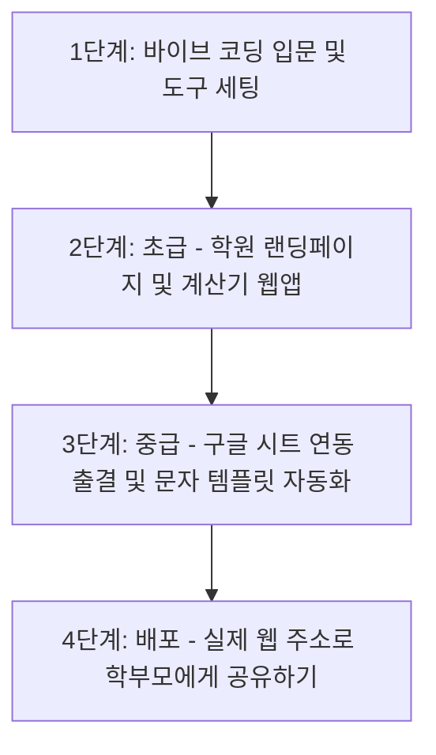

# 학원 원장 및 부원장 대상 AI 바이브 코딩 교육 커리큘럼

학원 원장 및 부원장(비개발자)들이 AI 코딩(바이브 코딩)을 쉽게 접하고, 학원 운영 효율화 및 마케팅에 즉시 적용할 수 있도록 설계된 교육 과정입니다. 유튜브 채널 **'기술노트with 알렉'(@with2511)**의 영상 흐름을 바탕으로 단계별 시청 가이드와 실습 주제를 매핑했습니다.

---

## 📅 교육 커리큘럼 로드맵 요약

---

## 🛠️ 단계별 시청 가이드 및 바이브 코딩 실습 주제

### 1단계: 바이브 코딩 입문 및 AI 에디터 세팅
> AI 코딩의 개념을 이해하고, 내 컴퓨터에 필요한 개발 환경을 구축하는 기초 단계입니다.

*   **시청 권장 기술노트 영상**
    *   *“바이브 코딩, 어떤 툴을 써야 할까요? Replit vs Cursor vs Windsurf”*
    *   *“바이브코딩에 Cursor, Windsurf, Claude Code 뭐 써야 해요?”*
    *   *“Windsurf를 이용하여 바이브 코딩을 해보자 | AI 에디터”*
*   **주요 학습 내용**
    *   바이브 코딩(Vibe Coding)의 개념: 코딩 문법을 몰라도 사람의 자연어(프롬프트)로 소프트웨어를 만드는 방법 이해.
    *   대표적인 AI 코드 에디터(Cursor 또는 Windsurf) 설치 및 환경 설정.
    *   AI에게 효과적으로 명령을 내리는 기본 대화 규칙(프롬프트 엔지니어링 기초).
*   **🎯 바이브 코딩 실습 주제: [AI 에디터와 첫 대화 및 웰컴 페이지 제작]**
    *   **내용**: AI에게 학원 브랜드 색상과 로고 이름이 들어간 아주 간단한 '학원 환영 안내 페이지(HTML)'를 만들어달라고 요청합니다.
    *   **명령(프롬프트) 예시**:
        > "우리 학원 이름인 '에듀클래스'가 타이틀로 들어간 깔끔하고 세련된 소개용 첫 웹 페이지(HTML)를 만들어줘. 학원 로고 자리와 간단한 소개 문구, 그리고 연락처가 들어가야 해. 전체적인 디자인 색감은 파스텔 톤의 파란색과 흰색을 섞어줘."

---

### 2단계: 초급 - 프론트엔드 UI/UX 중심 바이브 코딩
> 생성된 코드를 직접 브라우저에서 실행해보고, 디자인과 기능을 조금씩 수정해보는 단계입니다.

*   **시청 권장 기술노트 영상**
    *   *“AI 코딩의 놀라운 혁명. 웹복사, 문서작성 (feat. Cursor, Windsurf)”*
    *   *“Vibe Coding Complete Tutorial and Tips - Cursor / Windsurf”*
*   **주요 학습 내용**
    *   웹을 구성하는 3요소(HTML: 뼈대, CSS: 디자인, JavaScript: 기능)의 역할 이해.
    *   에디터에서 코드를 파일에 자동 반영(Apply)하고 저장하는 일련의 개발 사이클 체험.
    *   "이 버튼 크기를 키워줘", "배경 이미지를 다른 걸로 바꿔줘" 등 UI를 미세 조정하는 명령 기술.
*   **🎯 바이브 코딩 실습 주제 (택 1)**
    *   **주제 A: [학원 수강료 및 형제/다과목 할인 계산기]**
        *   **설명**: 신입생 상담 시 원장님이 노트북 화면을 보여주며 즉석에서 할인율을 계산해 줄 수 있는 웹앱입니다.
        *   **주요 기능**: 기본 수강료 입력란, 형제 할인(10% 할인), 다과목 수강(5% 할인) 등 체크박스 선택 기능, 최종 납부 금액 실시간 계산 및 예쁜 영수증 형태로 출력.
    *   **주제 B: [심플 학원 설명회/특강 예약 신청서 양식]**
        *   **설명**: 방학 특강이나 설명회 예약을 위해 학부모 이름, 자녀 학년, 연락처를 입력받을 수 있는 깔끔한 입력 폼 페이지입니다.

---

### 3단계: 중급 - 구글 시트 연동 및 상담 지원 도구 (행정 자동화)
> 단순한 화면 구성을 넘어 데이터를 저장하거나 외부 API를 활용해 실제 업무 생산성을 극대화하는 단계입니다.

*   **시청 권장 기술노트 영상**
    *   *“업무에 바로 쓰는 AI 자동화”*
    *   *“코딩 몰라도 복잡한 플랫폼 만드는 강의 출시! with Windsurf, Cursor, Claude Code”*
*   **주요 학습 내용**
    *   비개발자 행정 자동화의 필수 도구인 **구글 앱스 스크립트(GAS)**의 연동 기초.
    *   구글 스프레드시트에 저장된 데이터를 가져오거나 웹 양식의 입력값을 스프레드시트에 자동으로 쌓는 구조.
*   **🎯 바이브 코딩 실습 주제 (택 1)**
    *   **주제 A: [구글 시트 연동 학원생 간이 출결 체크 대시보드]**
        *   **설명**: 구글 스프레드시트에 학생 이름 목록을 적어두고, 웹 화면에서 '출석/지각/결석' 버튼을 클릭하면 구글 시트에 날짜별로 출결 여부가 실시간 기록되는 시스템입니다.
        *   **효과**: 비싼 학원 관리 프로그램을 쓰지 않고도 나만의 커스텀 출결 시스템을 직접 구축할 수 있습니다.
    *   **주제 B: [AI 기반 학부모 피드백 알림톡/문자 템플릿 생성기]**
        *   **설명**: 원장님이나 선생님이 당일 수업 특징(예: '단어 통과', '숙제 보통', '수업 태도 집중도 높음')을 핵심 단어로 입력하면, 학부모님께 보낼 정중하고 다정한 알림톡 문장을 생성해주는 도구입니다.

---

### 4단계: 배포 - 만든 웹앱 무료로 전 세계 배포하기
> 개발한 웹 사이트를 실제 인터넷 주소(URL)로 변환하여 모바일 스마트폰이나 외부에서 접속할 수 있도록 만드는 마지막 단계입니다.

*   **시청 권장 기술노트 영상**
    *   *“내가 만든 웹앱 무료로 전 세계에 배포하기 (Vercel, Netlify 활용)”* (유사 영상 포함)
*   **주요 학습 내용**
    *   Vercel 또는 Netlify 등의 무료 웹 호스팅 서비스 회원가입 및 사용법.
    *   내가 바이브 코딩으로 작성한 폴더를 드래그 앤 드롭하거나 연결하여 몇 초 만에 배포 URL(`https://my-academy.vercel.app`)을 발급받는 방법.
*   **🎯 바이브 코딩 실습 주제: [내 학원 랜딩 페이지 & 계산기 배포 및 스마트폰 접속 테스트]**
    *   **내용**: 2단계 또는 3단계에서 만든 수강료 계산기나 설명회 신청서 웹 사이트를 무료 도메인으로 배포합니다.
    *   **결과물**: 생성된 주소를 카카오톡으로 발송하여 스마트폰 화면에서 올바르게 터치하여 동작하는지 확인하고 학부모 상담 시나 학원 홍보 시 실제로 활용합니다.

---

## 💡 원장/부원장 대상 교육 진행 팁 (강사용 가이드)

1.  **눈에 보이는 시각적 효과 우선**: CSS 스타일링을 세련되게 뽑아내어 AI가 뚝딱 만들어내는 결과물에 시각적인 흥미를 느끼도록 해야 합니다. (예: "우리 학원 브랜드에 맞춰 디자인을 예쁘게 뽑아줘"라고 입력하여 완성도 높은 디자인을 먼저 확인시킵니다.)
2.  **프로그래밍 문법 설명 배제**: 변수, 루프, 함수 등의 프로그래밍 개념 설명은 최대한 지양하고, **"어떻게 질문해야 AI가 오류 없이 한 번에 고쳐주는지(프롬프트 작성법)"**와 **"오류가 났을 때 AI 에디터에 오류 메시지를 그대로 던져 해결하는 방법"**에 교육의 70% 이상을 할애해야 합니다.
3.  **복사-붙여넣기 강조**: 구글 스프레드시트의 확장 기능(앱스 스크립트)이나 Vercel 배포 시, 마우스 클릭 몇 번과 코드 복사-붙여넣기로 모든 것이 작동하는 과정을 직관적으로 시연해주면 실천 의지가 크게 상승합니다.
