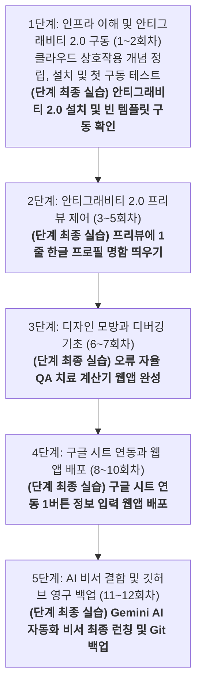

# [영상 교육 기획서] 학원 원장 대상 안티그래비티 2.0 활용 마스터 코스

본 교육 과정은 비대면 영상 강의(유튜브 및 온라인 튜토리얼)를 보고 수강생들이 스스로 학습하는 **'비대면 자기주도형 영상 교육'**에 특화되어 설계되었습니다. 

강사의 즉각적인 오프라인 조력이 없는 환경임을 고려하여, 수강생의 모든 조작 동선을 복잡한 로컬 PC 설정이 아닌 **'안티그래비티 2.0' 에디터 플랫폼 중심**으로 단일화했습니다. 덧셈(안티그래비티 프리뷰에 텍스트 출력)을 모르는 이에게 미적분(깃허브 연동, 서버 배포)을 요구하지 않도록, **"사전 시청한 영상 1개의 실제 내용과 안티그래비티 2.0 실습 수준이 100% 일치"**하도록 재설계하여 수강생들이 낙오 없이 완독할 수 있도록 구성했습니다.

> [!IMPORTANT]
> 본 기획서의 모든 동영상 가이드는 마우스로 클릭하면 즉시 유튜브의 실제 해당 영상으로 바로 연결되는 **"정식 하이퍼링크"**로 구성되어 있습니다. 수강생들은 링크를 클릭하여 즉시 강의를 시청할 수 있습니다.

---

## 📅 [대분류] 안티그래비티 2.0 중심 단계별 학습 로드맵

---

## 🛠️ [소분류] 단계별 세부 교육 과정 (12회차 통합본)

### 1단계: 인프라 이해 및 안티그래비티 2.0 구동 (1~2회차)
*   **단계 학습 목적**: 비대면 영상 강의 수강을 위해 인터넷 클라우드 서버와 내 안티그래비티 에디터의 통신 관계를 이해하고, 안티그래비티 2.0 설치 및 첫 구동 환경을 완벽하게 세팅하는 것입니다.
*   **종합 실습 프로세스**: 
    1.  **인프라 이해**: 만화 동영상을 시청하여 클라우드 서비스와 안티그래비티의 상호작용 개념 정립.
    2.  **프로그램 설치**: 안티그래비티 2.0 독립 실행형 도구를 다운로드하고 에이전트 가동 테스트 완료.

#### 1회차: 내 안티그래비티 2.0과 인터넷 클라우드의 작동 원리
*   **권장 시청 영상**: [서버란 무엇인가요? | 얄팍한 코딩사전](https://www.youtube.com/watch?v=R0YJ-r-qLNE)
*   **영상 실제 내용**: 원격 서버의 개념, 클라우드 호스팅의 개념, 그리고 내 컴퓨터와 클라우드가 데이터를 송수신하고 작동하는 기본적인 웹 인프라 구조를 만화와 비유로 설명합니다.
*   **주차 학습 내용**: 동영상을 시청하고 안티그래비티 에디터 외부 연동 시 필요한 기본 클라우드 통신 구조 이해하기. *(실습 없음)*

#### 2회차: 안티그래비티 2.0 에디터 다운로드 및 첫 구동
*   **권장 시청 영상**: [바이브코딩 구글 안티그래비티로 웹사이트 만들기 7탄 (제미나이 사용법, 안티그래비티 설치방법)](https://www.youtube.com/watch?v=hUtwQcRBods)
*   **영상 실제 내용**: 코딩 지식 없이 구글 안티그래비티(Google Antigravity) 에디터를 다운로드하고 초기 권한 및 환경을 세팅하는 과정을 안내합니다.
*   **주차 학습 내용**: 영상을 참고하여 안티그래비티 에디터 설치법을 배우고 실행 환경 설정을 완료합니다.
*   **🎯 [1단계 최종 실습과제]: 안티그래비티 2.0 설치 및 빈 템플릿 구동 확인**
    *   *실습 미션*: 안티그래비티 2.0 에디터를 성공적으로 설치하고 실행한 후, 새 빈 프로젝트를 생성하십시오. 에디터 우측의 내장 프리뷰 창에 빈 화면이 깨끗하게 구동되는 것을 확인하고, 좌측 챗 창에 `"안녕 안티그래비티"`라고 한글로 입력하여 AI 에이전트가 정상적으로 답변(환영 인사)을 출력하는 첫 동작 테스트를 완료하십시오. *(어떠한 화면 설계나 코드 수정도 요구하지 않는 가장 쉬운 설치 확인 단계)*

---

### 2단계: 안티그래비티 2.0 프리뷰 제어 (3~5회차)
*   **단계 학습 목적**: 깃허브나 서버 배포 같은 고난도 허들 없이, 오직 안티그래비티 에이전트와 대화하는 자연어 명령(프롬프트) 작성을 통해 내장 프리뷰 창에 웹 요소를 직접 띄우고 다듬는 실습입니다.
*   **종합 실습 프로세스**: 
    1.  **용어 습득**: AI 에이전트를 지휘하기 전 필수 IT 기초 어휘 20개 정리.
    2.  **자연어 명령**: 안티그래비티 에이전트에 내 포트폴리오 프로필 명함 정보를 자연어로 전달.
    3.  **프리뷰 조율**: 한 번에 과도한 코딩 요구를 하지 않고 잘게 쪼개어 제어하는 프롬프트 조율 요령 학습.
    4.  **최종 실습 수행**: 내장 프리뷰 창에 한글 명함과 버튼을 100% 정상 출력 완료.

#### 3회차: 안티그래비티 에이전트 조종용 필수 개념 용어 학습
*   **권장 시청 영상**: [개발 용어들, 헷갈리셨죠? 얄팍하게 정리해 드립니다 | 얄팍한 코딩사전](https://www.youtube.com/watch?v=GYmuQJiPeM4)
*   **영상 실제 내용**: 빌드, 디버그, API, 프레임워크 등 개발자와 대화하거나 에이전트 명령을 내릴 때 혼용하는 기본 IT 기초 어휘 개념을 쉽게 설명합니다.
*   **주차 학습 내용**: 학습 노트를 펴고 영상에 나오는 20대 용어를 메모하여 안티그래비티 에이전트와 대화할 어휘 빌드업. *(실습 없음)*

#### 4회차: 자연어 지시를 통한 프리뷰 화면 명함 출력 학습
*   **권장 시청 영상**: [바이브코딩 구글 안티그래비티로 웹사이트 만들기 1탄](https://www.youtube.com/watch?v=AWpy4w8Fd8k)
*   **영상 실제 내용**: 구글 안티그래비티를 실행한 상태에서 챗 창에 자연어로 요구사항을 내려 화면을 실시간 코딩하고 내장 프리뷰 창에 웹 화면을 표출하는 원리를 보여줍니다.
*   **주차 학습 내용**: 영상을 참고하여 에이전트에게 자연어 프롬프트 명령을 내리고 소통하는 기본 구조를 익힙니다. *(실습 없음)*

#### 5회차: 프리뷰 레이아웃 정밀 튜닝 및 지시 쪼개기 기법 학습
*   **권장 시청 영상**: [바이브코딩 구글 안티그래비티로 웹사이트 만들기 5탄 (보안방법, UI디자인)](https://www.youtube.com/watch?v=Zdpb8Ljew_U)
*   **영상 실제 내용**: 기존 웹사이트나 이미지를 참고하여 안티그래비티 에이전트에 UI 리디자인을 명령하는 방법, 그리고 스티치(Stitch) 도구와 연동하여 레이아웃을 단계적·정밀하게 다듬는 방법을 시연합니다.
*   **🎯 [2단계 최종 실습과제]: 안티그래비티 프리뷰에 1줄 한글 프로필 명함 띄우기**
    *   *실습 미션*: 3~5회차 영상을 시청한 후, 안티그래비티 에이전트에 자연어 명령(예: `"내 학원 이름은 OO학원이고 전화번호는 010-XXXX-XXXX야. 이 정보를 한 줄로 화면 중앙에 보기 좋게 띄워줘"`)을 작성하여, 내장 프리뷰 화면에 깔끔하게 출력되는 첫 웹 명함 화면을 자력으로 성공시켜 띄우십시오. *(깃허브/배포 없음)*

---

### 3단계: 디자인 모방과 디버깅 기초 (6~7회차)
*   **단계 학습 목적**: 에이전트에게 캡처 이미지를 제공해 레이아웃을 모방하는 방식을 학습하고, 웹앱 동작 설계 시 발생하는 실행 에러를 개발자 콘솔 로그 복사를 통한 에이전트 자율 QA 디버깅 기능으로 해결하는 법을 익힙니다.
*   **종합 실습 프로세스**:
    1.  **모방 기술 습득**: 이미지를 읽어 화면 레이아웃과 스타일을 복제해 내는 에이전트 동작 원리 이해.
    2.  **디버깅 기술 습득**: 프로그램 오작동 발생 시 콘솔 로그를 활용한 에이전트 에러 치료법 학습.
    3.  **최종 실습 수행**: 단과 계산기 웹앱을 만들고 에러 발생 지점을 자율 QA로 치료하여 완성.

#### 6회차: 스크린샷 캡처 업로드를 통한 안티그래비티 스타일 모방 학습
*   **권장 시청 영상**: [바이브코딩 구글 안티그래비티로 웹사이트 만들기 3탄 (UI디자인, 에이전트)](https://www.youtube.com/watch?v=eF9KA1XXi60)
*   **영상 실제 내용**: 완성된 웹 페이지의 캡처 스크린샷 이미지를 안티그래비티 에이전트에 제공하고, 이미지 내의 레이아웃 요소를 분석하여 에디터상에 스타일 복제를 명령하는 시연을 다룹니다.
*   **주차 학습 내용**: 안티그래비티 3탄 UI 디자인 영상을 시청하고, 학원 홍보 전단지나 캡처 이미지를 에디터에 업로드하여 3단 랜딩 페이지로 스타일을 모방하고 복제하도록 명령하는 조종법을 익힙니다. *(실습 없음)*

#### 7회차: 계산 기능 수식 적용 및 안티그래비티 QA봇 디버깅 학습
*   **권장 시청 영상**: [[코딩 1도 몰라도 만드는 나만의 PC 프로그램 1탄] 클립보드 붙여넣기 정리 프로그램 만들기](https://www.youtube.com/watch?v=gwej2gnigJY)
*   **영상 실제 내용**: 안티그래비티 에이전트로 PC 프로그램을 처음부터 직접 빌드하는 실전 과정을 보여줍니다. 제작 도중 오류가 발생하면 키보드 F12를 눌러 콘솔 로그를 복사한 뒤 에이전트에게 붙여넣어 자율 디버깅을 지시하는 에러 치료 기법을 실전으로 익힐 수 있습니다.
*   **🎯 [3단계 최종 실습과제]: 오류 자율 QA 치료 계산기 웹앱 완성**
    *   *실습 미션*: PC 프로그램 1탄 영상을 수강하고, 과목 선택 시 수강료가 자동 연산되어 보여지는 초간단 '단과 수강료 계산기'를 빌드하십시오. 실습 도중 오류나 오작동이 나면 키보드의 **F12** 키를 누르고 -> `Console` 탭을 마우스로 클릭한 뒤 -> 화면에 뜬 빨간색 에러 글자를 통째로 긁어 복사하여 안티그래비티 챗 창에 붙여넣고 "이 에러 고쳐줘"라고 요청하는 방식으로 자율 QA 치료 과정을 완료하십시오.

---

### 4단계: 구글 시트 연동과 웹 앱 배포 (8~10회차)
*   **단계 학습 목적**: 구글 시트를 학원의 데이터베이스(DB)로 엮고, 안티그래비티가 빌드한 구글 앱스 스크립트(GAS) 코드를 이식하여 모바일 접속 주소를 발급받는 전 과정을 완수합니다.
*   **종합 실습 프로세스**:
    1.  **구글 DB 연동**: 구글 스프레드시트에 테이블을 파고 AI에게 연동 구조를 설명하는 법 습득.
    2.  **모바일 배포**: 생성된 GAS 코드를 새 배포하여 모바일 전용 고유 URL을 획득하는 흐름 실습.
    3.  **최종 실습 수행**: 웹 화면에서 버튼을 누르면 구글 시트에 행 데이터가 즉시 저장되는 1버튼 입력기 배포.

#### 8회차: 구글 스프레드시트 구조 이해 및 안티그래비티 연동 설계 학습
*   **권장 시청 영상**: [코딩 몰라도 AI로 앱 개발?! 구글 시트로 10분 만에 끝내는 방법 | 오빠두엑셀](https://www.youtube.com/watch?v=F01zL3r0a14)
*   **영상 실제 내용**: 구글 시트와 앱스 스크립트, 그리고 AI(Gemini)를 연동하여 별도의 코딩 지식 없이 데이터를 송수신하고 처리하는 웹앱 제작과 배포 과정을 시연합니다.
*   **주차 학습 내용**: 구글 시트에 학생 이름, 연락처 등의 데이터 열(Column)을 기획하고 연동 데이터 구조를 파악합니다. *(실습 없음)*

#### 9회차: 안티그래비티 생성 GAS 이식 및 구글 웹앱 배포 학습
*   **권장 시청 영상**: [코딩 몰라도 AI로 앱 개발?! 구글 시트로 10분 만에 끝내는 방법 | 오빠두엑셀](https://www.youtube.com/watch?v=F01zL3r0a14)
*   **영상 실제 내용**: 구글 시트의 앱스 스크립트 에디터에서 웹앱 '새 배포' 설정을 마우스 클릭으로 간편하게 수행하여 누구나 접속 가능한 모바일용 웹 URL 주소를 런칭하는 흐름을 보여줍니다.
*   **주차 학습 내용**: 안티그래비티가 구글 시트 연동용으로 작성한 GAS 코드를 시트 스크립트 에디터에 이식하고 권한 승인을 완료하는 법을 익힙니다. *(실습 없음)*

#### 10회차: API 통신 구조 학습 및 Gemini API 획득
*   **권장 시청 영상**: [API가 뭔가요? 가장 쉽게 이해시켜드림 | 얄팍한 코딩사전](https://www.youtube.com/watch?v=GjYJp3q4x-4)
*   **영상 실제 내용**: 프로그램들이 서로 통신하기 위한 다리 역할을 하는 API와 보안을 위한 API Key 개념을 식당 점원 비유를 통해 아주 쉽고 직관적으로 이해시켜줍니다.
*   **🎯 [4단계 최종 실습과제]: 구글 시트 연동 1버튼 정보 입력 웹앱 배포**
    *   *실습 미션*: 먼저 오늘 배운 대로 [Google AI Studio](https://aistudio.google.com/)에 접속하여 무료 Gemini API Key를 직접 발급받으십시오 *(10회차 학습 연계)*. 그 다음, 8~9회차에서 익힌 방법을 바탕으로 안티그래비티가 생성한 GAS 스크립트를 내 구글 시트에 마우스 클릭 몇 번으로 이식한 후, 최종 구글 웹앱 배포를 완료하여 스마트폰으로 접속 가능한 고유 URL 도메인을 런칭하십시오.

---

### 5단계: AI 비서 결합 및 깃허브 영구 백업 (11~12회차)
*   **단계 학습 목적**: 구글 Gemini API를 내 구글 웹앱에 이식하여 상황별 메시지 자동 완성 비서 서비스를 구현하고, 평생 소장할 마스터 코드를 안티그래비티 Git 제어판을 통해 깃허브 저장소에 백업하여 교육을 마감합니다.
*   **종합 실습 프로세스**:
    1.  **AI 탑재**: 구글 AI 스튜디오에서 발급받은 Gemini API 키를 내 웹앱 코드에 심는 법 습득.
    2.  **최종 릴리즈**: AI 자동 안부문자 완성 웹앱 서비스를 최종 업데이트 배포하여 스마트폰 탑재.
    3.  **영구 보존**: 안티그래비티 Git 제어판을 활용하여 원클릭으로 깃허브 원격 저장소에 업로드 마감.

#### 11회차: 안티그래비티 AI 비서 탑재 및 1초 안부문자기 최종 배포 학습
*   **권장 시청 영상**: [5분 만에 끝내는 Google AI Studio API 키 발급 및 사용법](https://www.youtube.com/watch?v=hyD7YdTqhM8)
*   **영상 실제 내용**: 발급받은 외부 Gemini AI API 키를 웹앱의 입력 폼에 탑재하여, 프롬프트 지시에 따라 상황별 어투(존댓말)에 맞춰 실시간 텍스트 안부 문장을 생성하고 문자/카카오톡 전송 창을 띄워주는 연동 방식을 다룹니다.
*   **주차 학습 내용**: 영상을 통해 구글 AI 스튜디오 가입 및 무료 API Key를 발급받은 뒤, 안티그래비티 코드 내에 생성된 API 변수 자리에 발급받은 키를 맵핑하고 문자 자동 완성을 연동시키는 흐름을 파악합니다. *(실습 없음)*

#### 12회차: 안티그래비티 2.0 원클릭 Git 연동 및 최종 백업 마스터
*   **권장 시청 영상**: [제대로 파는 Git & GitHub (리뉴얼) | 얄팍한 코딩사전](https://www.youtube.com/watch?v=0TEPC1UDGM0)
*   **영상 실제 내용**: 코드 버전 관리와 백업의 필수 도구인 Git의 기본 사용법과 GitHub 원격 저장소에 프로젝트를 연동하여 평생 백업하는 과정을 총정리해줍니다.
*   **🎯 [5단계 최종 실습과제]: Gemini AI 자동화 비서 최종 런칭 및 Git 백업**
    *   *실습 미션*: **[1단계] AI 비서 최종 확인**: 11회차에서 완성한 Gemini AI 안부문자 비서 기능이 스마트폰에서 버튼 클릭 시 정상적으로 메시지를 자동 생성하는지 최종 확인하십시오. **[2단계] Git 영구 백업**: 확인 완료 후, 안티그래비티 2.0의 Git 제어판에서 [원클릭 연동] 버튼을 눌러 깃허브 계정에 로그인하고, 12주 완성 마스터 코드를 영구 보존용 저장소에 원클릭으로 커밋 및 푸시(Push)하십시오. *(두 단계를 순서대로 하나씩 진행하면 됩니다)*

---

## 🚨 [보너스 가이드] 사전 준비물 및 에러 대처 가이드

### 1. 개강 전 필수 준비물 리스트
*   **구글(Google) 계정**: 구글 드라이브 및 스프레드시트(출석부 DB) 연동에 필수적으로 필요합니다.
*   **깃허브(GitHub) 무료 계정**: 안티그래비티에서 빌드하는 코드의 실시간 클라우드 백업을 위해 미리 가입이 필요합니다.
*   **Gemini API Key 발급용 계정**: 10회차 실습을 위해 [Google AI Studio](https://aistudio.google.com/) 가입이 필요합니다.
*   **학원 리소스 준비**: 4회차 및 6회차 실습에 활용할 **학원 로고 이미지(PNG 파일)** 및 기본 학원 소개 텍스트를 지참해야 합니다.

### 2. 안티그래비티 2.0 실습 중 오작동/에러 발생 시 대처법
*   **권장 시청 영상 (디버깅 가이드)**: [[코딩 1도 몰라도 만드는 나만의 PC 프로그램 1탄] 클립보드 붙여넣기 정리 프로그램 만들기](https://www.youtube.com/watch?v=gwej2gnigJY) 영상을 통해 F12 콘솔 디버깅 시연 시청
*   **상황별 조치 매뉴얼**:
    *   **화면 멈춤 및 무한 로딩**: 안티그래비티 에이전트가 백그라운드 코딩 중 루프에 빠진 경우, 우측 상단 `Stop` 버튼을 눌러 작업을 일시 정단한 뒤 "방금 작성 중이던 코드 롤백해줘"라고 지시합니다.
    *   **에러 발생 시**: 안티그래비티 내장 프리뷰 창에서 오작동하거나 에러가 나면, 당황하지 말고 키보드 **F12**를 눌러 `Console` 창에 뜨는 빨간색 에러 메시지를 마우스로 통째로 긁어 복사한 뒤, 안티그래비티 챗 창에 던져서 "이 에러 메시지가 뜨는데 해결해줘"라고 요청(자가 치료)합니다.
