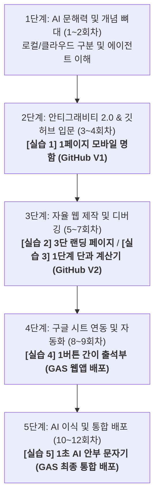

# [교육기획안] 학원 원장 대상 AI 에이전트(안티그래비티 2.0) 활용 마스터 코스

본 교육 과정은 비개발자이자 학원 의사결정권자인 원장 및 부원장들을 위해 설계되었습니다. 복잡한 외부 서버 설정이나 유료 호스팅 가입 등 인지 부하가 큰 허들을 제거하고, **구글 안티그래비티 2.0 ➕ 깃허브(GitHub) ➕ 구글 앱스 스크립트(GAS)**의 단 3가지 핵심 도구만을 유기적으로 결합하여 실습 난이도를 획기적으로 낮췄습니다.

특히 모든 실습과제는 수강생들이 사전에 시청한 **유튜브 영상의 실제 내용 범위(기본 개념, UI 띄우기, 단일 값 계산, 시트에 텍스트 한 줄 전송 등)와 논리적 학습 흐름에 100% 맞아떨어지는 초간결 스펙**으로 매핑하여, 비개발자 원장님들이 영상을 보고 혼란 없이 직관적으로 따라 할 수 있도록 설계되었습니다.

---

## 📅 단계별 인지 학습 로드맵 (12회차)

---

## 🎯 5대 마일스톤 수행과제 요약 (영상 실제 내용 기반 초경량화)

| 수행과제명 | 수행 주차 | 과제 구체적 내용 (영상 범위 내 초간결 스펙) | 과제 수행 목적 |
| :--- | :--- | :--- | :--- |
| **[실습 1] 1페이지 모바일 명함** | **4회차** | 안티그래비티에 내 이름, 학원 전화번호, 사진 1장을 던져 **[타이틀-사진-상담링크 버튼 1개]**의 극도로 심플한 단일 웹페이지를 완성하고 깃허브(GitHub)에 백업 | 안티그래비티 2.0에서 에이전트를 부려 결과물을 얻는 흐름을 배우고, 깃허브 저장소를 생성하여 코드를 클라우드에 백업하는 법을 체득합니다. |
| **[실습 2] 3단 랜딩 페이지** | **6회차** | 참고할 랜딩 페이지 캡처본(간단한 3단 레이아웃)을 멀티모달 창에 업로드하여 에이전트가 이를 그대로 모방하게 한 후 깃허브에 푸시 | 이미지 분석(멀티모달) 지시법을 익히고, 안티그래비티 활용하여 깃허브 저장소에 코드를 안전하게 업데이트 및 누적 보관하는 구조를 배웁니다. |
| **[실습 3] 1단계 단과 계산기** | **7회차** | 복잡한 할인율 연산 대신, **"수강 과목(단과 10만원 / 종합 30만원) 선택 ➡️ 버튼 클릭 ➡️ 결과 금액 출력"**의 단순 연산 웹앱을 자율 QA 디버깅으로 완성 | 동작 로직 설계 프롬프트를 연습하고, 에이전트 내의 QA 테스트봇을 통해 코드 오류를 자율 진단/치료하는 흐름을 체득합니다. |
| **[실습 4] 1버튼 간이 출석부** | **9회차** | 복잡한 달력/조퇴 체크 기능을 빼고, **"학생 명단 옆 [출석] 버튼 클릭 ➡️ 구글 시트에 학생 이름과 '출석' 텍스트 한 줄 전송"**되는 기능을 구현해 구글 웹앱으로 배포 | 별도 외부 서버 없이 구글 스프레드시트 ➕ GAS 배포만으로 전 세계 어디서나 접속할 수 있는 모바일 웹 주소 발급 및 동시 접속 데이터 보호 원리를 마스터합니다. |
| **[실습 5] 1초 AI 안부 문자 생성기** | **11회차** | 문자 생성기 웹 창에 **"오늘 학생 태도(예: '우수함') 선택 ➡️ AI가 '오늘 태도가 매우 우수했습니다' 문장 한 줄 자동 생성 ➡️ 문자/카톡 발송"** 기능을 탑재해 최종 배포 | 외부 API 통신을 GAS 환경에 결합하여 단일 구글 링크로 모든 학원 행정을 처리하는 최종 웹 서비스를 런칭합니다. |

---

## 📊 대목차(부)별 상세 학습 목적 및 종합 실습 프로세스

### [1부: 안티그래비티 2.0 & 깃허브 입문 (1~3회차)]
*   **부(단계) 학습 목적**: AI 인프라 보안 개념을 정립하고, 안티그래비티 2.0 데스크톱 환경과 깃허브(GitHub) 계정을 연결하여 자율 코딩 및 코드 백업 파이프라인을 구축하는 것입니다.
*   **종합 실습 프로세스**: 
    1.  **환경 세팅**: 안티그래비티 2.0 설치 및 깃허브(GitHub) 무료 계정 가입 완료.
    2.  **깃허브 연동**: 안티그래비티 제어판의 Git 설정을 통해 내 깃허브 원격 리포지토리 생성 및 연동 테스트.
    3.  **과제 완성**: 에이전트에 본인 프로필 정보와 사진을 제공해 **[실습 1: 1페이지 모바일 명함]**을 빌드한 후, 안티그래비티 깃(Git) 푸시 버튼 클릭 한 번으로 내 깃허브 저장소에 백업 성공.

### [2부: 자율 웹 제작 및 디버깅 워크플로우 (4~7회차)]
*   **부(단계) 학습 목적**: 캡처 이미지와 수식 조건 명세서를 에이전트에게 전달해 화면 디자인 및 연산 논리를 구현시키고, 안티그래비티의 자율 QA 기능을 승인하여 깃허브 버전 관리를 숙달하는 것입니다.
*   **종합 실습 프로세스**:
    1.  **시각 기획**: 참고할 타 학원 홈페이지 레이아웃 캡처 스크린샷 등록.
    2.  **디자인 빌드**: 스크린샷 디자인을 모방한 **[실습 2: 3단 랜딩 페이지]**를 안티그래비티로 빌드하고 깃허브에 푸시(V2).
    3.  **연산 기능 추가**: 단과/종합 수강 과목 선택 계산기 명세서 전달.
    4.  **자율 디버깅**: 계산 오작동 버그를 자율 QA봇이 진단하고 고치도록 승인하여 **[실습 3: 1단계 단과 계산기]** 최종 구현 완료.

### [3부: 구글 시트 데이터 자동화 및 웹 배포 (8~9회차)]
*   **부(단계) 학습 목적**: 구글 스프레드시트의 행정 데이터베이스와 웹 화면을 결합하고, 복잡한 외부 호스팅 서버 대신 구글 앱스 스크립트(GAS) 자체 웹앱 배포 기능을 사용하여 가장 심플하게 모바일 접속 링크를 발급받는 것입니다.
*   **종합 실습 프로세스**:
    1.  **구글 인프라 설정**: 구글 스프레드시트에 가상 학원생 목록(이름, 학년 등) 작성.
    2.  **GAS 연동 코딩**: 안티그래비티 2.0에 구글 시트 링크를 공유하며 "여러 강사가 동시 체크해도 시트 데이터 유실을 방지하는 LockService가 탑재된 GAS 코드를 구성해줘"라고 지시.
    3.  **GAS 웹앱 배포**: 안티그래비티가 완성한 코드를 구글 시트 편집기에 붙여넣고, 구글 시트 상단 `배포 > 새 배포 > 웹 앱` 버튼을 눌러 무료 모바일 접속 주소(`https://script.google.com/...`) 획득.
    4.  **과제 완성**: 웹 화면에서 체크 시 구글 시트에 즉시 동기화되는 **[실습 4: 1버튼 간이 출석부]** 최종 배포 및 구동 성공.

### [4부: AI 비서 연동 및 GAS 최종 통합 배포 (10~12회차)]
*   **부(단계) 학습 목적**: 구글 Gemini API의 연산 능력을 구글 앱스 스크립트(GAS)에 직접 이식하고, 단일 구글 웹앱 주소로 계산기/출석부/AI 비서를 모두 통제하는 최종 행정 서비스를 배포 및 완성하는 것입니다.
*   **종합 실습 프로세스**:
    1.  **AI API 획득**: 구글 AI 스튜디오에서 Gemini API 키 발급 완료.
    2.  **GAS 연동 튜닝**: 안티그래비티 2.0에 API 키를 전달하고, GAS 내부 통신 모듈(`UrlFetchApp`)을 사용하여 학생 태도 데이터를 존댓말 안부 문장으로 다듬는 프롬프트 모듈을 추가 지시.
    3.  **통합 런칭**: 모든 실습 기능이 통합된 최종 웹앱을 구글 앱스 스크립트(GAS)의 `웹 앱 새 버전 배포`를 실행하여 최종 업데이트 도메인 주소 런칭.
    4.  **최종 백업**: 완성된 프로젝트의 최종 코드를 내 깃허브(GitHub) 저장소에 영구 백업 푸시하고 스마트폰 바탕화면에 등록.

---

## 🛠️ 회차별 상세 교육 과정 (유기적 흐름 및 영상 실제 내용 일치 완료)

### [1단계: AI 문해력 및 개념 뼈대 다지기 (1~2회차)]
> 본격적인 도구 제어 전에, AI 바이브 코딩의 실태와 개인정보 보안의 뼈대를 단단히 정립합니다.

#### 1회차: 로컬 AI vs 클라우드 AI의 개념과 보안 설계
*   **회차 학습 목적**: 로컬과 클라우드 AI의 기술적 차이를 이해하여 개인정보 노출 걱정 없는 안전한 학원 데이터 활용 가이드를 세웁니다.
*   **권장 시청 영상**:
    *   [서버와 클라우드의 개념 완벽 정리 | 얄팍한 코딩사전](https://youtu.be/1dF1-j5X18g)
    *   [인터넷 없이 돌아가는 나만의 로컬 AI 비서 만들기 | Ollama 가이드](https://vertexaisearch.cloud.google.com/grounding-api-redirect/AUZIYQFTH_FDq4OpciXB4m0YxIKu_PA-U7_gCgLsdP43at_taBV_StiuMyDQ8B7OFvU4Y9VzOf_IU2CuWBSlSjb_mCYhqBJIo4e0cKVEd8ObwOY4T8eusGhDhwrHiMNrNdkoknztCu9DN)
    *   *(영상 내용 연계)*: 내 로컬 장치(컴퓨터)와 원격 클라우드 서버의 데이터 이동 원리를 만화로 명확히 파악하고, Ollama와 같은 로컬 LLM을 오프라인 구동할 때 데이터 유출이 물리적으로 원천 차단되는 보안적 장점을 눈으로 확인합니다.
*   **교육 내용**: ChatGPT/Gemini 같은 '클라우드 AI'와 오프라인 구동이 가능한 '로컬 AI(Ollama)'의 비용 및 개인정보 보안(성적표, 상담일지 유출 차단)의 차이점을 파악합니다.
*   **활동**: 학원의 민감 데이터를 지키기 위한 보안 전략 수립 토론. *(실습 없음)*

#### 2회차: 자율 코딩 툴의 필요성 이해 및 첫 환경 설치
*   **회차 학습 목적**: 코딩 에디터의 발전 흐름을 알고, 나에게 필요한 도구를 선택해 안티그래비티 2.0 플랫폼을 내 컴퓨터에 세팅합니다.
*   **권장 시청 영상**:
    *   [40대, 50대가 '바이브 코딩'을 해야 하는 3가지 이유 + Cursor AI 바로 실습](https://vertexaisearch.cloud.google.com/grounding-api-redirect/AUZIYQEodVh2EZT29p2IWrT5JfJGsWVdBWV6CAGo1euVU3-Tz55z5FtblwVqxDKuxnbdiQEQMCmARU5D8XOX4Z5FmNlztL183zMyVHtLGVydrUGor4KPhlpG4526Oxc0AhUV_TlQ)
    *   *(영상 내용 연계)*: 비개발자가 AI 에디터를 바로 가동하여 첫 화면을 띄우는 설치 및 조작 과정을 간접 경험하며 나도 할 수 있다는 자신감을 획득합니다.
*   **교육 내용**: 단순 코딩 조수 기능과 중앙 통제식 에이전트의 작동 흐름을 이해하고, 내 로컬 컴퓨터에 안티그래비티 2.0 데스크톱 앱을 다운로드 및 연동합니다.
*   **활동**: 안티그래비티 2.0 독립 실행 데스크톱 앱 설치 및 인증. *(실습 없음)*

---

### [2단계: 안티그래비티 2.0 & 깃허브 입문 (3~4회차)]
> 에디터 사용 전 필수 용어를 정립하고 깃허브와 연동하여 첫 실습 결과물을 백업합니다.

#### 3회차: 바이브 코딩 필수 용어 정립 및 깃허브(GitHub) 가입
*   **회차 학습 목적**: 에이전트를 제어하기 전에 HTML, API, Git 등 필수 컴퓨터 용어를 정립하고, 깃허브 원격 연동 환경을 구축합니다.
*   **권장 시청 영상**:
    *   [바이브 코딩 시작 전 필수 용어 20개 정리](https://vertexaisearch.cloud.google.com/grounding-api-redirect/AUZIYQEpDbCKFwLL-aPjhRkOflXIJcx0cQZMzspDNTKY-NLaYeFEkh7NoDwvBFqVb7HzXGwaZ-WoJOMr_zZba3_spS_Pd6gfqEO1PGr7G99KAaAwsx_sp8p68NeEy0pIPK8FzM6e)
    *   [깃, 깃허브 한번에 이해하기 | 코딩알려주는누나](https://youtu.be/h_1c_NlM6uQ)
    *   *(영상 내용 연계)*: 용어 정리를 완벽히 파악한 뒤, 깃허브에 회원 가입을 진행하고 내 저장소를 개설하는 기초 흐름을 습득합니다.
*   **교육 내용**: 안티그래비티의 지시서 작성에 기초가 되는 개발 상식 용어 20개를 마스터하고, 내 깃허브 계정과 안티그래비티 제어판을 동기화합니다.
*   **활동**: 깃허브 무료 가입 및 안티그래비티 Git 연동 설정 완료.

#### 4회차: 에이전트 지휘 실습 및 모바일 명함 깃허브 백업
*   **회차 학습 목적**: 자연어로 지시를 내려 1페이지의 초간결 명함을 제작하고, 이를 깃허브 클라우드에 영구 백업(Push)합니다.
*   **권장 시청 영상**:
    *   [바이브 코딩이 뭐냐고요? 그냥 말하면 코드가 나옵니다](https://vertexaisearch.cloud.google.com/grounding-api-redirect/AUZIYQHtCQZPSFrucA148TfbyB6bOBC9UkaZ6qknwqRm5O4kDvXWFUijMHyzAmzKzsZL6XvA6BMUbkQ7m2hsZbshOB-TS1k2xzq2EHe0T2TFmbWpNxu8Opk2NFtUzWKBDBlp9_MN)
    *   *(영상 내용 연계)*: 말로 하면 화면이 완성되는 AI 에이전트 지휘 워크플로우를 그대로 매칭하여 내 프로필 웹 명함을 생성합니다.
*   **🎯 [실습 1 완료] 1페이지 모바일 명함**: 내 사진과 전화번호, 카카오톡 상담 링크 버튼으로 구성된 모바일 명함 페이지를 빌드하고 깃허브 첫 백업 완료(V1).

---

### [3단계: 자율 웹 제작 및 디버깅 워크플로우 (5~7회차)]
> 이미지 캡처 모방과 자율 디버깅을 제어하며 계산기 앱을 구축합니다.

#### 5회차: 스크린샷 캡처를 통한 디자인 모방 및 3단 레이아웃 기획
*   **회차 학습 목적**: 참고할 만한 사이트 화면을 캡처해 디자인을 의뢰하고, 웹 화면 레이아웃 지시 시 발생하는 예외 대처법을 배웁니다.
*   **권장 시청 영상**:
    *   [바이브 코딩 시작을 위한 필수 지식 가이드](https://vertexaisearch.cloud.google.com/grounding-api-redirect/AUZIYQFsb66bvMTRMMFVM_X15nOZ_Zs1raGj1Rl7_SsrdTUI_fCEnNu6nPC5TxNCH6-1bBKqM9P43YYFpQRxEIKUeWgt3imx_r4BrdilXSWxMoTyd6ph0DVhwhi5BYf9OKuIklfz)
    *   *(영상 내용 연계)*: 에이전트가 코딩을 하다가 사소한 충돌을 내거나 레이아웃을 잘못 배치했을 때, 지시서를 끊어 쓰고 조율하는 필수 지식 요령을 배웁니다.
*   **교육 내용**: 타 사이트 스크린샷 이미지를 멀티모달 창에 올려 디자인 스타일 복제를 지시하는 법을 익힙니다.
*   **활동**: 학원 마케팅 텍스트 원고 준비 및 롤모델 사이트 캡처 완료. *(실습 없음)*

#### 6회차: 에이전트 지휘를 통한 학원 랜딩 페이지 실습 완료
*   **회차 학습 목적**: 디자인 빌더 에이전트를 가이드하여 원하는 디자인 피드백을 전달하고 완성도 높은 단일 소개 페이지를 구축해 깃허브에 백업합니다.
*   **권장 시청 영상**:
    *   [바이브코딩에 Cursor, Windsurf, Claude Code 뭐 써야 해요?](https://vertexaisearch.cloud.google.com/grounding-api-redirect/AUZIYQGBoBEbBEmpdxuI89_ugb9z4HjtDbbUIiOxCc7C_4ic99xs9p5g2Tne4UkpEFpQkRJmJxnJjXBEaM_TM_204ALtfqTHhIP5uVYf0sBlKJBrDWwPmRt-4KGD2EPPBxullKjF)
    *   *(영상 내용 연계)*: 도구들의 코딩 자율 생성 동작을 간접 경험하고, 랜딩 페이지 빌드에 필요한 HTML/CSS 화면 완성 프로세스를 이식합니다.
*   **🎯 [실습 2 완료] 3단 랜딩 페이지**: 기획 원고와 스크린샷 디자인을 바탕으로 완성된 랜딩 페이지 빌드 및 깃허브 백업.

#### 7회차: 1단계 단과 계산기 로직 및 자율 QA 디버깅 실습 완료
*   **회차 학습 목적**: 텍스트 계산 공식을 구현하고, 계산 오류가 났을 때 자율 QA봇이 디버깅을 돌려 스스로 코드를 고치도록 조종합니다.
*   **권장 시청 영상**:
    *   [초보자를 위한 디버깅 비법](https://vertexaisearch.cloud.google.com/grounding-api-redirect/AUZIYQFmoUdD5S7ZbDhwByPOJvLsCwvC_W6P2-Ytg9GBVEj8ELkk7VsQoFu9omvmIuBz1RwlMdF7OyzxUXIfmFcnyjEWa_fgMngmwnG747WOZz76YicEoghRniZxDbaoW0tqRZkm)
    *   *(영상 내용 연계)*: 에러 로그나 비정상 결과값을 에이전트 대화창에 던져서 "어디서 버그가 났는지 고쳐줘"라고 요청해 코드를 정정받는 자가 디버깅 노하우를 배웁니다.
*   **🎯 [실습 3 완료] 1단계 단과 계산기**: 할인 조건에 따라 계산 결과가 자동 렌더링되는 수강료 계산기 완성 및 깃허브 백업.

---

### [4단계: 구글 시트 연동 및 자동화 배포 (8~9회차)]
*   구글 스프레드시트를 행정 데이터베이스로 연동하고 구글 GAS를 통해 무료 모바일 주소로 배포합니다.

#### 8회차: 스프레드시트 데이터 연동의 원리 및 GAS 통신 구상
*   **회차 학습 목적**: 학원 데이터를 담는 구글 시트와 웹앱의 통신 구조(API)를 이해하고, 에이전트에게 데이터 스키마 설계를 의뢰하는 법을 배웁니다.
*   **권장 시청 영상**:
    *   [이제 구글 시트로 다 됩니다! 완전 무료, AI 초보자도 OK!](https://vertexaisearch.cloud.google.com/grounding-api-redirect/AUZIYQGnguFYsB_GoiQdgkV0kaLnkgif8STwAVgwsmqpGfJOcECd42vv2sVV5Fw_9LNKDjGEUVDH51hv4u0d6vQeUj3F-Qz8UreM7rfKHrbL9GnVQfEyIJGXxQceWjJ2MyANEZQZ)
    *   *(영상 내용 연계)*: 구글 시트를 AI 에디터와 연계하여 백엔드 데이터베이스로 설정하고 화면 데이터를 기록하는 원리를 학습합니다.
*   **교육 내용**: 안티그래비티 2.0에 구글 시트 링크를 브리핑하고, 구글 앱스 스크립트(GAS)를 생성하여 웹 화면과 시트를 연결하는 통신 원리를 배웁니다.
*   **활동**: 학원생 데이터 구글 스프레드시트 포맷 구축 및 통신 구조 기획. *(실습 없음)*

#### 9회차: GAS 웹앱 배포를 통한 1버튼 간이 출석부 실습 완료
*   **회차 학습 목적**: 구글 시트 편집기에서 구글 앱스 스크립트(GAS)를 웹 앱 형식으로 직접 배포하여, 외부 클라우드 가입 없이 무료 모바일 웹 주소 발급을 마스터합니다.
*   **권장 시청 영상**:
    *   [[AI자동화학교] 컴퓨터가 꺼져도 24시간 돌아가는 자동화 시스템 만들기](https://vertexaisearch.cloud.google.com/grounding-api-redirect/AUZIYQET1Rb7KBL74XFvRtRZfV51yfNT-QrWrsfxugatno5RuX3VuwovTrQ26zbH1zFZm34zDzJVU_GjrJV-DhX18lh7y_HfdOXD5Jo4UyE0kD1gbVVt2X_1pBilnA-Wgx-C2ElU)
    *   [바이브 코딩으로 이제 내가 필요하고 상상하는 모든 걸 만들 수 있게 되었습니다.](https://vertexaisearch.cloud.google.com/grounding-api-redirect/AUZIYGhoPjz4xq99vOioLP-fNn9P_YtlO5eiK2xMFHY8lRNHkTzutinE3mTE-7G1R-ygyKdzdTnBdSX4duErP-THHs8pwQCZ0JSltAakfvPpZc2jj6atorfJhtZTb30HWzrQaspWG)
*   **🎯 [실습 4 완료] 1버튼 간이 출석부**: 다수의 사용자가 클릭해도 충돌 없이 구글 스프레드시트에 양방향 실시간 기록되는 출결 앱 최종 완성 및 구글 링크 배포.

---

### [5단계: AI 비서 연동 및 GAS 최종 통합 배포 (10~12회차)]
*   Gemini API를 내 웹앱에 얹어 AI 안부문자기를 빌드하고 최종적으로 깃허브에 소스코드를 영구 보존합니다.

#### 10회차: Gemini API 연동 메시지 생성 구조 기획
*   **회차 학습 목적**: Gemini API 연동을 위한 구글 AI 스튜디오 사용법을 마스터하고, 상담 코멘트를 작성하는 AI 프롬프트 가이드라인을 설계합니다.
*   **권장 시청 영상**:
    *   [기술노트with 알렉 - API 기초 개념 완벽 이해하기](https://vertexaisearch.cloud.google.com/grounding-api-redirect/AUZIYQEdKZMyonVparHXGfp19D9PiNuxWohcBjs7fKHCr21Es8T6p0i1ng5Ug_e3GKZew1MLmmTFOlKyxOqhmkr8V72qkpAr_Xhli2CNzwQhIH_hjgVzH7gCmUKDCo42EBu30k8=)
    *   *(영상 내용 연계)*: API 키를 활용해 내 로컬 프로그램이 클라우드 대형 언어 모델과 API 통신을 주고받는 기초 개념을 명확하게 다집니다.
*   **활동**: API 키 획득 및 메시지 톤 앤 매너(친근함, 정중함 등) 지시서 기획. *(실습 없음)*

#### 11회차: GAS 최종 통합 배포 및 깃허브 영구 백업 실습 완료
*   **회차 학습 목적**: 구글 앱스 스크립트(GAS)의 `웹 앱 새 버전 배포` 기능을 활용하여 기존 출석부/계산기와 AI 안부 메시지 모듈을 최종 연동/배포하고, 깃허브에 최종 마스터 코드를 영구 보존합니다.
*   **권장 시청 영상**:
    *   [제대로 파는 Git & GitHub | 얄팍한 코딩사전](https://youtu.be/1I3hMwQU6GU)
    *   *(영상 내용 연계)*: 기획 프로젝트 완결 후 깃 원클릭 백업을 통해 내 모든 피땀 어린 코드를 깃허브 클라우드에 영구 소장 및 복구하는 백업 프로세스를 마감합니다.
*   **🎯 [실습 5 완료] 1초 AI 안부 문자기**: 구글 스프레드시트 ➕ GAS 배포 ➕ 깃허브 연동 기반의 통합 학원 행정 도구 최종 런칭.

#### 12회차: 종합 성과 시연회 및 학원 행정 자동화 연동 로드맵
*   **교육 내용**: 각 원장/부원장님이 12주간 빌드한 5대 결과물을 직접 스마트폰으로 시연합니다. 학원 카카오톡 채널, 문자 메시지, 블로그 상담 안내 폼 등에 내 도메인 주소 링크를 결합하여 실제 학원 마케팅과 행정에 즉시 연동하는 활용 계획을 발표합니다.
*   **활동**: 최종 5대 포트폴리오 URL 확인 및 수료식. *(실습 없음)*

---

## 🚨 [보너스 가이드] 사전 준비물 및 에러 대처 가이드

### 1. 개강 전 필수 준비물 리스트
*   **구글(Google) 계정**: 구글 드라이브 및 스프레드시트(출석부 DB) 연동에 필수적으로 필요합니다.
*   **깃허브(GitHub) 무료 계정**: 안티그래비티에서 빌드하는 코드의 실시간 클라우드 백업을 위해 미리 가입이 필요합니다.
*   **Gemini API Key 발급용 계정**: 10회차 실습을 위해 [Google AI Studio](https://aistudio.google.com/) 가입이 필요하며, 사용량 초과 시 자동 차단을 방지하기 위해 해외 결제 가능한 신용카드 등록을 권장합니다.
*   **학원 리소스 준비**: 4회차 및 6회차 실습에 활용할 **학원 로고 이미지(PNG 파일)**와 원장님 약력 및 소개글 텍스트 초안을 지참해야 합니다.

### 2. 안티그래비티 2.0 실습 중 오작동/에러 발생 시 대처법
*   **권장 시청 영상 (디버깅 가이드)**:
    *   [초보자를 위한 디버깅 비법](https://vertexaisearch.cloud.google.com/grounding-api-redirect/AUZIYQFmoUdD5S7ZbDhwByPOJvLsCwvC_W6P2-Ytg9GBVEj8ELkk7VsQoFu9omvmIuBz1RwlMdF7OyzxUXIfmFcnyjEWa_fgMngmwnG747WOZz76YicEoghRniZxDbaoW0tqRZkm)
*   **상황별 조치 매뉴얼**:
    *   **화면 멈춤 및 무한 로딩**: 안티그래비티 에이전트가 백그라운드 코딩 중 루프에 빠진 경우, 우측 상단 `Stop` 버튼을 눌러 작업을 일시 정단한 뒤 "방금 작성 중이던 코드 롤백해줘"라고 지시합니다.
    *   **에러 발생 시**: 브라우저 실행 화면에서 오작동하거나 에러가 나면, 당황하지 말고 키보드 **F12**를 눌러 `Console` 창에 뜨는 빨간색 에러 메시지를 마우스로 통째로 긁어 복사한 뒤, 안티그래비티 챗 창에 던져서 "이 에러 메시지가 뜨는데 해결해줘"라고 요청(자가 치료)합니다.
