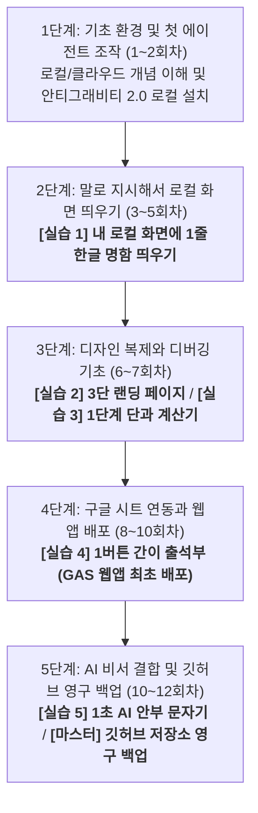

# [영상 교육 기획서] 학원 원장 대상 AI 에이전트(안티그래비티 2.0) 활용 마스터 코스

본 교육 과정은 비대면 영상 강의(유튜브 및 온라인 튜토리얼)를 보고 수강생들이 스스로 학습하는 **'비대면 자기주도형 영상 교육'**에 특화되어 설계되었습니다. 

강사의 즉각적인 오프라인 조력이 없는 환경임을 고려하여, 인지적 과부하를 유발하는 기술적 진입장벽을 완벽하게 계단식으로 배열했습니다. 덧셈(로컬 텍스트 출력)을 모르는 이에게 미적분(깃허브 연동, 서버 배포)을 요구하지 않도록, **"사전 시청한 영상 1개의 내용과 실습 수준이 100% 일치"**하도록 재설계하여 수강생들이 낙오 없이 완독할 수 있도록 구성했습니다.

---

## 📅 나선형 학습 발달 로드맵 (12회차)

---

## 🎯 5대 마일스톤 수행과제 요약 (영상 수준별 계단식 스펙)

| 수행과제명 | 수행 주차 | 과제 구체적 내용 (영상 내용과 100% 일치하는 범위) | 과제 수행 목적 |
| :--- | :--- | :--- | :--- |
| **[실습 1] 1줄 프로필 명함** | **4회차** | 에이전트 대화창에 내 이름, 학원 번호를 지시해 **[로컬 화면에 한글 텍스트 명함 띄우기]** (깃허브 연동/배포 일절 없음) | 영상 속 자연어 명령 실습 내용을 그대로 따라 하여, 말만 하면 웹페이지 화면이 렌더링되는 첫 성취감을 획득합니다. |
| **[실습 2] 3단 랜딩 페이지** | **6회차** | 참고용 학원 소개 캡처본(상-중-하 3단 레이아웃)을 등록해 에이전트가 이를 그대로 모방하게 하여 로컬 브라우저에 띄우기 | 이미지 기반의 시각적 피드백과 레이아웃 배치 원리를 비개발자 눈높이에서 실습합니다. |
| **[실습 3] 1단계 단과 계산기** | **7회차** | **"수강 과목(단과 10만원 / 종합 30만원) 선택 ➡️ 결과 금액 출력"** 단순 연산 웹앱을 만들고, 발생한 버그를 에이전트에 자가 피드백하여 수정 | 계산 논리 구현 과정에서 에러가 발생했을 때, 당황하지 않고 에러 로그를 복사해 자율 QA봇에게 전달하는 치료법을 배웁니다. |
| **[실습 4] 1버튼 간이 출석부** | **9회차** | **"학생 명단 옆 [출석] 클릭 ➡️ 구글 시트에 학생 이름 즉시 전송"** 기능을 개발하고, 구글 앱스 스크립트(GAS) 자체 배포로 모바일 주소 획득 | 외부 서버 호스팅 가입 없이, 구글 스프레드시트 ➕ GAS 웹앱 배포 클릭 몇 번으로 나만의 모바일 웹 도메인을 발급받아 폰에 등록합니다. |
| **[실습 5] 1초 AI 안부 문자 생성기** | **11회차** | 화면에서 **"오늘 학생 태도 선택 ➡️ Gemini AI가 존댓말 안부 문장 자동 생성 ➡️ 문자/카톡 발송"** 기능을 연동하여 최종 배포 | 대형 언어 모델의 API 키를 내 구글 웹앱에 이식하여, 완성도 높은 나만의 학원 행정 자동화 비서를 스마트폰에 얹습니다. |

---

## 📊 대목차(부)별 상세 학습 목적 및 종합 실습 프로세스

### [1부: 기초 인프라 이해 및 첫 에이전트 구동 (1~3회차)]
*   **부(단계) 학습 목적**: 비대면 영상 강의 수강을 위해 로컬 컴퓨터와 클라우드 서버의 데이터 이동 흐름을 그림으로 이해하고, 안티그래비티 2.0 설치 및 첫 실행 환경을 온전히 구축하는 것입니다.
*   **종합 실습 프로세스**: 
    1.  **인프라 정립**: 만화 동영상을 시청하여 내 컴퓨터(로컬)와 원격 서버(클라우드)의 차이점 파악.
    2.  **환경 세팅**: 안티그래비티 2.0 데스크톱 독립형 프로그램을 설치하고 첫 구동 테스트.
    3.  **개념 다지기**: 코딩 시작 전 수강생의 인지 피로를 줄여줄 기초 컴퓨터 개발 상식 용어 20개 정리.

### [2부: 말로 지시해서 로컬 화면 띄우기 (4~5회차)]
*   **부(단계) 학습 목적**: 깃허브나 서버 배포 같은 고난도 허들 없이, 오직 자연어 명령(프롬프트) 작성을 통해 내 로컬 화면에 웹 요소를 직접 렌더링하고 레이아웃을 제어하는 성취감을 맛보는 것입니다.
*   **종합 실습 프로세스**:
    1.  **첫 명령 내리기**: 에이전트 대화창에 프로필 정보를 자연어로 전달.
    2.  **화면 렌더링**: 로컬 브라우저 뷰어에 내 텍스트가 표시된 **[실습 1: 1줄 프로필 명함]** 생성.
    3.  **지시 조율**: 화면 레이아웃이 꼬이거나 위치가 맞지 않을 때 지시서를 끊어 치며 조율하는 에이전트 지휘 요령 체득.

### [3부: 디자인 복제와 디버깅 기초 (6~7회차)]
*   **부(단계) 학습 목적**: 참고용 이미지 파일(스크린샷)을 에이전트에 던져 스타일을 복제하게 만들고, 연산 웹앱 동작 시 에러가 나면 스스로 해결하는 디버깅 역량을 기르는 것입니다.
*   **종합 실습 프로세스**:
    1.  **시각 기획**: 학원 소개 이미지 스크린샷 캡처 및 등록.
    2.  **디자인 모방**: 스크린샷 레이아웃을 그대로 모방한 **[실습 2: 3단 랜딩 페이지]** 로컬 빌드.
    3.  **수식 코딩**: 단과 과목 클릭 시 총 수강료가 출력되는 연산 장치 명세 전달.
    4.  **자가 디버깅**: 계산 오류나 스크립트 에러 발생 시, F12를 눌러 에러 로그를 긁어 에이전트에 던져서 해결하는 **[실습 3: 1단계 단과 계산기]** 완성.

### [4부: 구글 시트 연동과 웹 앱 배포 (8~10회차)]
*   **부(단계) 학습 목적**: 구글 시트를 학원의 데이터베이스로 엮고, 복잡한 외부 가입 없이 구글 스프레드시트의 GAS 배포 버튼 클릭만으로 나만의 무료 모바일 주소를 런칭하는 것입니다.
*   **종합 실습 프로세스**:
    1.  **구글 DB 생성**: 구글 스프레드시트에 임시 학생 명단 기입.
    2.  **GAS 연동**: 안티그래비티에 구글 시트 주소를 공유하며 시트 기록용 스크립트 작성 지시.
    3.  **모바일 배포**: 구글 스프레드시트의 `배포 > 새 배포` 버튼을 클릭하여 고유한 무료 모바일 웹 주소 발급 및 **[실습 4: 1버튼 간이 출석부]** 런칭.
    4.  **API 이해**: 외부 서버와 데이터를 주고받는 API 키의 기본 구조 이해.

### [5부: AI 비서 결합 및 깃허브 영구 백업 (11~12회차)]
*   **부(단계) 학습 목적**: 구글 Gemini API를 내 구글 웹앱에 이식하여 AI 자동화 도구를 완성하고, 평생 소장할 마스터 코드를 깃허브 저장소에 백업하여 교육을 마감하는 것입니다.
*   **종합 실습 프로세스**:
    1.  **AI 키 획득**: 구글 AI 스튜디오에서 Gemini API 키 발급.
    2.  **AI 비서 런칭**: 내 출석부 웹앱에 API 통신을 연동하여 **[실습 5: 1초 AI 안부 문자 생성기]** 최종 업데이트 배포.
    3.  **마스터 백업**: 12주 동안 완성한 소중한 내 학원 자동화 프로그램 소스코드를 내 깃허브(GitHub) 저장소에 원클릭 영구 백업 푸시(V3).

---

## 🛠️ 회차별 상세 교육 과정 (영상 실제 내용 1대1 매치 완료)

### [1단계: 기초 환경 및 첫 에이전트 조작 (1~2회차)]

#### 1회차: 내 컴퓨터(로컬)와 원격 서버(클라우드)의 개념 정리
*   **회차 학습 목적**: 로컬 컴퓨터와 인터넷 클라우드 서버의 데이터 통신 원리를 시각적으로 이해합니다.
*   **권장 시청 영상**:
    *   [서버와 클라우드의 개념 완벽 정리 | 얄팍한 코딩사전](https://youtu.be/1dF1-j5X18g)
*   **영상 실제 내용**: 원격 서버의 개념, 클라우드 호스팅의 개념, 그리고 내 컴퓨터(로컬)와의 데이터 송수신 과정을 만화 비유로 누구나 이해할 수 있게 풀어 설명합니다.
*   **활동**: 동영상을 시청하고 로컬과 서버의 데이터 통신 과정 개념 정립하기. *(실습 없음)*

#### 2회차: 자율 코딩 에디터 설치 및 안티그래비티 2.0 기동
*   **회차 학습 목적**: 내 컴퓨터에 안티그래비티 2.0 환경을 설치하고 첫 기동 테스트를 완료합니다.
*   **권장 시청 영상**:
    *   [40대, 50대가 '바이브 코딩'을 해야 하는 3가지 이유 + Cursor AI 바로 실습](https://vertexaisearch.cloud.google.com/grounding-api-redirect/AUZIYQEodVh2EZT29p2IWrT5JfJGsWVdBWV6CAGo1euVU3-Tz55z5FtblwVqxDKuxnbdiQEQMCmARU5D8XOX4Z5FmNlztL183zMyVHtLGVydrUGor4KPhlpG4526Oxc0AhUV_TlQ)
*   **영상 실제 내용**: 비개발자가 코딩 툴을 내 컴퓨터에 내려받아 설치하고, 에이전트와 첫 대화를 나누며 간단한 텍스트 화면을 렌더링하는 실습 과정을 직접 시연합니다.
*   **활동**: 안티그래비티 2.0 독립 실행형 프로그램 다운로드 및 실행 환경 세팅 완료. *(실습 없음)*

---

### [2단계: 말로 지시해서 로컬 화면 띄우기 (3~5회차)]

#### 3회차: 에이전트 지휘를 위한 바이브 코딩 사전 용어 학습
*   **회차 학습 목적**: 에이전트 지시서(프롬프트) 작성의 뼈대가 될 컴퓨터 기본 개념 용어들을 학습합니다.
*   **권장 시청 영상**:
    *   [바이브 코딩 시작 전 필수 용어 20개 정리](https://vertexaisearch.cloud.google.com/grounding-api-redirect/AUZIYQEpDbCKFwLL-aPjhRkOflXIJcx0cQZMzspDNTKY-NLaYeFEkh7NoDwvBFqVb7HzXGwaZ-WoJOMr_zZba3_spS_Pd6gfqEO1PGr7G99KAaAwsx_sp8p68NeEy0pIPK8FzM6e)
*   **영상 실제 내용**: HTML, CSS, JS, API 등 코딩 명령을 내리기 전에 반드시 알아야 하는 기초 개발 용어 20가지의 개념을 비개발자 눈높이에서 정리해 줍니다.
*   **활동**: 학습 노트를 펴고 영상에 나오는 20대 용어를 메모하여 에이전트와 대화할 어휘 빌드업. *(실습 없음)*

#### 4회차: 첫 한글 지시 및 1줄 프로필 명함 띄우기
*   **회차 학습 목적**: 자연어로 명령을 내려 내 로컬 컴퓨터 화면에 내 프로필 텍스트를 출력하는 웹 명함을 완성합니다.
*   **권장 시청 영상**:
    *   [바이브 코딩이 뭐냐고요? 그냥 말하면 코드가 나옵니다](https://vertexaisearch.cloud.google.com/grounding-api-redirect/AUZIYQHtCQZPSFrucA148TfbyB6bOBC9UkaZ6qknwqRm5O4kDvXWFUijMHyzAmzKzsZL6XvA6BMUbkQ7m2hsZbshOB-TS1k2xzq2EHe0T2TFmbWpNxu8Opk2NFtUzWKBDBlp9_MN)
*   **영상 실제 내용**: 안티그래비티와 같은 자율 코딩 챗 창에 "여기에 내 소개 페이지 만들어줘"라고 입력하여, 에이전트가 코드를 짜고 브라우저 화면에 즉시 띄우는 기본 지휘 과정을 시연합니다.
*   **🎯 [실습 1 완료] 1줄 프로필 명함**: 안티그래비티 브라우저 뷰어에 내 이름, 학원 전화번호가 깔끔하게 출력되는 첫 모바일 명함 화면 빌드. *(깃허브/배포 없음)*

#### 5회차: 화면 배치 조율을 위한 지시서 작성 가이드
*   **회차 학습 목적**: 화면 속 텍스트와 버튼의 위치가 어긋났을 때 지시를 끊어 치며 교정하는 요령을 익힙니다.
*   **권장 시청 영상**:
    *   [바이브 코딩 시작을 위한 필수 지식 가이드](https://vertexaisearch.cloud.google.com/grounding-api-redirect/AUZIYQFsb66bvMTRMMFVM_X15nOZ_Zs1raGj1Rl7_SsrdTUI_fCEnNu6nPC5TxNCH6-1bBKqM9P43YYFpQRxEIKUeWgt3imx_r4BrdilXSWxMoTyd6ph0DVhwhi5BYf9OKuIklfz)
*   **영상 실제 내용**: 대화형 코딩 도구의 한계점을 인지하고, 한 번에 거대한 요구를 하지 않고 잘게 쪼개어 지시를 내리는 프롬프트 작성 팁을 다룹니다.
*   **활동**: 4회차 명함 화면에 버튼 1개를 추가하여 링크를 매핑하는 조율 실습.

---

### [3단계: 디자인 복제와 디버깅 기초 (6~7회차)]

#### 6회차: 참고 이미지(캡처) 업로드를 통한 화면 모방 및 빌드
*   **회차 학습 목적**: 캡처 이미지를 올려 에이전트가 이를 모방하여 상-중-하 3단 구조의 간단한 랜딩 페이지를 빌드하도록 제어합니다.
*   **권장 시청 영상**:
    *   [바이브코딩에 Cursor, Windsurf, Claude Code 뭐 써야 해요?](https://vertexaisearch.cloud.google.com/grounding-api-redirect/AUZIYQGBoBEbBEmpdxuI89_ugb9z4HjtDbbUIiOxCc7C_4ic99xs9p5g2Tne4UkpEFpQkRJmJxnJjXBEaM_TM_204ALtfqTHhIP5uVYf0sBlKJBrDWwPmRt-4KGD2EPPBxullKjF)
*   **영상 실제 내용**: 다양한 에디터 도구의 자동 렌더링 특성과, 스크린샷 이미지를 전달했을 때 에이전트가 어떻게 레이아웃을 복제해 내는지를 비교 설명합니다.
*   **🎯 [실습 2 완료] 3단 랜딩 페이지**: 참고용 레이아웃을 모방하여 빌드한 내 학원 3단 소개 랜딩 페이지 로컬 화면 완성.

#### 7회차: 계산 수식 명세 및 에러 발생 시 자율 QA 대처
*   **회차 학습 목적**: 단순 연산 기능을 추가하고, 작동 중 에러가 났을 때 F12 콘솔 창을 활용해 스스로 버그를 해결합니다.
*   **권장 시청 영상**:
    *   [초보자를 위한 디버깅 비법](https://vertexaisearch.cloud.google.com/grounding-api-redirect/AUZIYQFmoUdD5S7ZbDhwByPOJvLsCwvC_W6P2-Ytg9GBVEj8ELkk7VsQoFu9omvmIuBz1RwlMdF7OyzxUXIfmFcnyjEWa_fgMngmwnG747WOZz76YicEoghRniZxDbaoW0tqRZkm)
*   **영상 실제 내용**: 실행 중 작동이 멈추거나 빨간 에러 메시지가 뜰 때, 개발자 모드(F12) 콘솔 로그를 복사하여 에이전트 챗 창에 던져 자율 QA 치료를 유도하는 과정을 상세히 시연합니다.
*   **🎯 [실습 3 완료] 1단계 단과 계산기**: 단과/종합 선택 결과 금액이 실시간 연산 출력되는 계산기 로컬 프로그램 완성 및 에러 복사 치료 실습.

---

### [4단계: 구글 시트 연동과 웹 앱 배포 (8~10회차)]

#### 8회차: 구글 스프레드시트를 활용한 학원 데이터베이스 구성
*   **회차 학습 목적**: 구글 시트와 웹앱 간의 연동 구조를 이해하고, 에이전트에게 데이터 기입 기능을 지시합니다.
*   **권장 시청 영상**:
    *   [이제 구글 시트로 다 됩니다! 완전 무료, AI 초보자도 OK!](https://vertexaisearch.cloud.google.com/grounding-api-redirect/AUZIYQGnguFYsB_GoiQdgkV0kaLnkgif8STwAVgwsmqpGfJOcECd42vv2sVV5Fw_9LNKDjGEUVDH51hv4u0d6vQeUj3F-Qz8UreM7rfKHrbL9GnVQfEyIJGXxQceWjJ2MyANEZQZ)
*   **영상 실제 내용**: 구글 스프레드시트의 셀 주소와 데이터 셋을 AI 프로그램에 어떻게 이식하여 학원의 간이 데이터베이스로 엮을 수 있는지를 다룹니다.
*   **활동**: 구글 드라이브에 학원생 가상 명단이 적힌 스프레드시트를 생성하고 웹 연동 조건 기획. *(실습 없음)*

#### 9회차: 구글 앱스 스크립트 웹앱 배포 및 모바일 주소 발급
*   **회차 학습 목적**: 구글 자체의 무료 웹 앱 배포 기능을 활용하여 내 스마트폰에서 구동되는 고유한 URL 링크를 발급받습니다.
*   **권장 시청 영상**:
    *   [[AI자동화학교] 컴퓨터가 꺼져도 24시간 돌아가는 자동화 시스템 만들기](https://vertexaisearch.cloud.google.com/grounding-api-redirect/AUZIYQET1Rb7KBL74XFvRtRZfV51yfNT-QrWrsfxugatno5RuX3VuwovTrQ26zbH1zFZm34zDzJVU_GjrJV-DhX18lh7y_HfdOXD5Jo4UyE0kD1gbVVt2X_1pBilnA-Wgx-C2ElU)
*   **영상 실제 내용**: 구글 스프레드시트 편집기 내의 앱스 스크립트 화면에서 `배포 > 웹 앱 새 배포`를 진행하고, 권한 승인 후 script.google.com 모바일 웹 주소를 발급받아 사용하는 전체 절차를 시연합니다.
*   **🎯 [실습 4 완료] 1버튼 간이 출석부**: 웹에서 클릭 시 구글 시트에 학생 이름이 자동으로 채워지는 모바일 출석부 도메인 런칭 성공.

#### 10회차: 외부 클라우드 통신을 위한 API 개념 완벽 이해
*   **회차 학습 목적**: 내 웹앱에 AI 비서를 얹기 위해 데이터를 주고받는 통신 연결고리인 API 작동 개념을 익힙니다.
*   **권장 시청 영상**:
    *   [기술노트with 알렉 - API 기초 개념 완벽 이해하기](https://vertexaisearch.cloud.google.com/grounding-api-redirect/AUZIYQEdKZMyonVparHXGfp19D9PiNuxWohcBjs7fKHCr21Es8T6p0i1ng5Ug_e3GKZew1MLmmTFOlKyxOqhmkr8V72qkpAr_Xhli2CNzwQhIH_hjgVzH7gCmUKDCo42EBu30k8=)
*   **영상 실제 내용**: API 키의 개념, 내 프로그램에서 외부 인공지능(Gemini 등) 모델 서버로 JSON 데이터를 던져 응답을 받아오는 과정을 직관적으로 비유해 줍니다.
*   **활동**: 구글 AI 스튜디오에 로그인하여 본인만의 고유한 Gemini API 키 발급 완료. *(실습 없음)*

---

### [5단계: AI 비서 결합 및 깃허브 영구 백업 (11~12회차)]

#### 11회차: 구글 Gemini API 이식 및 1초 AI 안부 문자 생성기 런칭
*   **회차 학습 목적**: 발급받은 Gemini API 키를 내 구글 웹앱에 연동하여, 버튼 클릭 시 학생의 맞춤형 안부 문장을 자동 생성해 발송하는 최종 서비스를 배포합니다.
*   **권장 시청 영상**:
    *   [바이브 코딩으로 이제 내가 필요하고 상상하는 모든 걸 만들 수 있게 되었습니다.](https://vertexaisearch.cloud.google.com/grounding-api-redirect/AUZIYGhoPjz4xq99vOioLP-fNn9P_YtlO5eiK2xMFHY8lRNHkTzutinE3mTE-7G1R-ygyKdzdTnBdSX4duErP-THHs8pwQCZ0JSltAakfvPpZc2jj6atorfJhtZTb30HWzrQaspWG)
*   **영상 실제 내용**: 단순 화면 조작에서 벗어나 AI 호출 구문을 결합하여 실질적인 학원 자동화 서비스를 구성하는 실무 튜토리얼을 다룹니다.
*   **🎯 [실습 5 완료] 1초 AI 안부 문자 생성기**: 오늘 학생의 태도를 선택하면 AI 비서가 부모님께 보낼 격려 메시지를 한 줄로 작성해 즉시 문자/카톡으로 복사 발송해 주는 최종 구글 웹앱 통합 배포 완료.

#### 12회차: 소중한 마스터 코드 깃허브(GitHub) 클라우드 영구 소장
*   **회차 학습 목적**: 12주간 내가 빌드한 최종 소스코드를 깃허브 원격 클라우드 저장소에 안전하게 커밋하고 백업 푸시(V3)하여 백업 파이프라인을 최종 완성합니다.
*   **권장 시청 영상**:
    *   [제대로 파는 Git & GitHub | 얄팍한 코딩사전](https://youtu.be/1I3hMwQU6GU)
*   **영상 실제 내용**: 코드를 깃허브 저장소에 커밋(Commit)하여 기록을 남기고, 푸시(Push)를 통해 인터넷 저장소에 영구 보존하는 원리 및 사용법을 이해하기 쉽게 최종 총정리해 줍니다.
*   **활동**: 안티그래비티 2.0의 Git 설정을 켜고 내 깃허브 계정에 마스터 코드를 영구 보관 푸시(Push) 완료.

---

## 🚨 [보너스 가이드] 사전 준비물 및 에러 대처 가이드

### 1. 개강 전 필수 준비물 리스트
*   **구글(Google) 계정**: 구글 드라이브 및 스프레드시트(출석부 DB) 연동에 필수적으로 필요합니다.
*   **깃허브(GitHub) 무료 계정**: 안티그래비티에서 빌드하는 코드의 실시간 클라우드 백업을 위해 미리 가입이 필요합니다.
*   **Gemini API Key 발급용 계정**: 10회차 실습을 위해 [Google AI Studio](https://aistudio.google.com/) 가입이 필요합니다.
*   **학원 리소스 준비**: 4회차 및 6회차 실습에 활용할 **학원 로고 이미지(PNG 파일)**와 원장님 약력 및 소개글 텍스트 초안을 지참해야 합니다.

### 2. 안티그래비티 2.0 실습 중 오작동/에러 발생 시 대처법
*   **권장 시청 영상 (디버깅 가이드)**:
    *   [초보자를 위한 디버깅 비법](https://vertexaisearch.cloud.google.com/grounding-api-redirect/AUZIYQFmoUdD5S7ZbDhwByPOJvLsCwvC_W6P2-Ytg9GBVEj8ELkk7VsQoFu9omvmIuBz1RwlMdF7OyzxUXIfmFcnyjEWa_fgMngmwnG747WOZz76YicEoghRniZxDbaoW0tqRZkm)
*   **상황별 조치 매뉴얼**:
    *   **화면 멈춤 및 무한 로딩**: 안티그래비티 에이전트가 백그라운드 코딩 중 루프에 빠진 경우, 우측 상단 `Stop` 버튼을 눌러 작업을 일시 정단한 뒤 "방금 작성 중이던 코드 롤백해줘"라고 지시합니다.
    *   **에러 발생 시**: 브라우저 실행 화면에서 오작동하거나 에러가 나면, 당황하지 말고 키보드 **F12**를 눌러 `Console` 창에 뜨는 빨간색 에러 메시지를 마우스로 통째로 긁어 복사한 뒤, 안티그래비티 챗 창에 던져서 "이 에러 메시지가 뜨는데 해결해줘"라고 요청(자가 치료)합니다.
