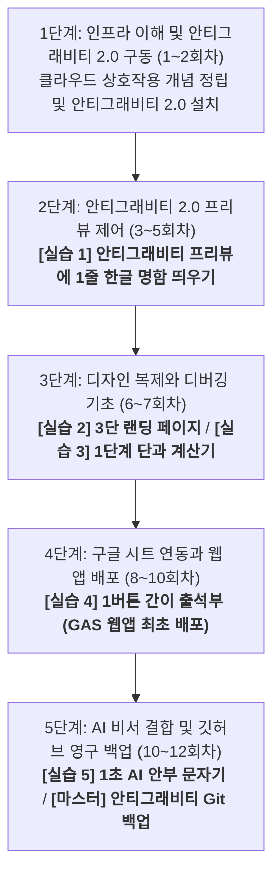

# [영상 교육 기획서] 학원 원장 대상 안티그래비티 2.0 활용 마스터 코스

본 교육 과정은 비대면 영상 강의(유튜브 및 온라인 튜토리얼)를 보고 수강생들이 스스로 학습하는 **'비대면 자기주도형 영상 교육'**에 특화되어 설계되었습니다. 

강사의 즉각적인 오프라인 조력이 없는 환경임을 고려하여, 수강생의 모든 조작 동선을 복잡한 로컬 PC 설정이 아닌 **'안티그래비티 2.0' 에디터 플랫폼 중심**으로 단일화했습니다. 덧셈(안티그래비티 프리뷰에 텍스트 출력)을 모르는 이에게 미적분(깃허브 연동, 서버 배포)을 요구하지 않도록, **"사전 시청한 영상 1개의 실제 내용과 안티그래비티 2.0 실습 수준이 100% 일치"**하도록 재설계하여 수강생들이 낙오 없이 완독할 수 있도록 구성했습니다.

---

## 📅 안티그래비티 2.0 중심 학습 로드맵 (12회차)

---

## 🎯 5대 마일스톤 수행과제 요약 (안티그래비티 2.0 조작 스펙)

모든 실습은 복잡한 PC 로컬 설정을 배제하고, 안티그래비티 2.0 에디터 및 내장 프리뷰 창 안에서 진행됩니다.

| 수행과제명 | 수행 주차 | 과제 구체적 내용 (안티그래비티 2.0 조작 범위) | 과제 수행 목적 |
| :--- | :--- | :--- | :--- |
| **[실습 1] 1줄 프로필 명함** | **4회차** | 안티그래비티 에이전트 챗 창에 내 정보를 지시해 **[안티그래비티 프리뷰 화면에 한글 텍스트 명함 띄우기]** (깃허브 연동/배포 일절 없음) | 영상 속 자연어 명령 실습을 따라 하여, 안티그래비티 프리뷰 창에 웹 화면이 즉시 렌더링되는 첫 성취감을 획득합니다. |
| **[실습 2] 3단 랜딩 페이지** | **6회차** | 참고용 학원 소개 캡처본(3단 레이아웃)을 업로드하여 에이전트가 모방하게 한 뒤 **[안티그래비티 프리뷰에 띄우기]** | 이미지 분석 기능(멀티모달)과 레이아웃 배치 원리를 안티그래비티 에디터 상에서 실습합니다. |
| **[실습 3] 1단계 단과 계산기** | **7회차** | **"수강 과목 선택 ➡️ 버튼 클릭 ➡️ 결과 금액 출력"** 단순 연산 웹앱을 만들고, 발생한 버그를 안티그래비티 QA봇으로 교정 | 안티그래비티 에디터 실행 중 작동 에러가 났을 때, 에러 로그를 챗 창에 전달하여 AI가 자율 치료하게 하는 법을 배웁니다. |
| **[실습 4] 1버튼 간이 출석부** | **9회차** | **"학생 명단 옆 [출석] 클릭 ➡️ 구글 시트에 학생 이름 즉시 전송"** 기능을 안티그래비티로 구현하고 구글 GAS 배포 | 외부 호스팅 가입 없이, 구글 스프레드시트 ➕ GAS 웹앱 배포를 활용해 나만의 모바일 웹 도메인을 런칭합니다. |
| **[실습 5] 1초 AI 안부 문자 생성기** | **11회차** | 화면에서 **"오늘 학생 태도 선택 ➡️ Gemini AI가 존댓말 안부 문장 자동 생성 ➡️ 문자/카톡 발송"** 기능을 연동하여 최종 배포 | 대형 언어 모델의 API 키를 내 구글 웹앱에 이식하여, 완성도 높은 나만의 학원 행정 자동화 비서를 스마트폰에 얹습니다. |

---

## 📊 대목차(부)별 상세 학습 목적 및 종합 실습 프로세스

### [1부: 안티그래비티 2.0 세팅 및 기본 구동 (1~3회차)]
*   **부(단계) 학습 목적**: 비대면 영상 강의 수강을 위해 인터넷 클라우드 서버와 내 안티그래비티 에디터의 통신 관계를 이해하고, 안티그래비티 2.0 설치 및 첫 구동 환경을 완벽하게 세팅하는 것입니다.
*   **종합 실습 프로세스**: 
    1.  **인프라 이해**: 만화 동영상을 시청하여 클라우드 서비스와 안티그래비티의 상호작용 개념 정립.
    2.  **프로그램 설치**: 안티그래비티 2.0 독립 실행형 도구를 다운로드하고 에이전트 가동 테스트 완료.
    3.  **개념 다지기**: 에이전트에 지시를 내리기 전에 꼭 알아야 하는 기초 개발 상식 용어 20개 정리.

### [2부: 안티그래비티 2.0 프리뷰 제어 (4~5회차)]
*   **부(단계) 학습 목적**: 깃허브나 서버 배포 같은 고난도 허들 없이, 오직 안티그래비티 에이전트와 대화하는 자연어 명령(프롬프트) 작성을 통해 내장 프리뷰 창에 웹 요소를 직접 띄우고 다듬는 실습입니다.
*   **종합 실습 프로세스**:
    1.  **자연어 명령**: 안티그래비티 에이전트에 프로필 정보를 자연어로 전달.
    2.  **프리뷰 확인**: 안티그래비티 내장 프리뷰 화면에 즉시 띄워진 **[실습 1: 1줄 프로필 명함]** 결과 확인.
    3.  **지시 조율**: 프리뷰 화면의 구성이 맘에 들지 않을 때 지시를 쪼개어 전달하는 에디터 조종 요령 체득.

### [3부: 디자인 복제와 디버깅 기초 (6~7회차)]
*   **부(단계) 학습 목적**: 참고용 이미지 파일(스크린샷)을 안티그래비티에 업로드하여 스타일을 모방하게 하고, 연산 웹앱 동작 시 발생하는 에러를 안티그래비티 자율 QA 기능을 통해 해결하는 것입니다.
*   **종합 실습 프로세스**:
    1.  **시각 피드백**: 학원 소개 이미지 스크린샷 캡처본을 안티그래비티 챗 창에 등록.
    2.  **스타일 모방**: 안티그래비티 에이전트가 복제한 **[실습 2: 3단 랜딩 페이지]** 프리뷰 확인.
    3.  **연산 기능 설계**: 단과 과목 선택 시 수강료가 합산 출력되는 명세 전달.
    4.  **자율 디버깅**: 프리뷰 테스트 오작동 시, 내장 F12 콘솔 로그를 안티그래비티 챗 창에 공유하여 자율 QA 치료를 통과한 **[실습 3: 1단계 단과 계산기]** 완성.

### [4부: 구글 시트 연동과 웹 앱 배포 (8~10회차)]
*   **부(단계) 학습 목적**: 구글 시트를 학원의 데이터베이스로 엮고, 안티그래비티가 빌드한 구글 앱스 스크립트(GAS) 코드를 이식하여 모바일 접속 주소를 발급받는 것입니다.
*   **종합 실습 프로세스**:
    1.  **구글 DB 생성**: 구글 스프레드시트에 학생 명단 기입.
    2.  **GAS 코드 추출**: 안티그래비티에 구글 시트 주소를 브리핑하고 시트 기록용 스크립트 코드 생성 의뢰.
    3.  **모바일 배포**: 생성된 코드를 구글 시트 배포 메뉴에 등록하여 무료 모바일 웹 주소 발급 및 **[실습 4: 1버튼 간이 출석부]** 런칭.
    4.  **API 개념**: 외부 서비스 연동을 위한 API 키의 기능 구조 이해.

### [5부: AI 비서 결합 및 깃허브 영구 백업 (11~12회차)]
*   **부(단계) 학습 목적**: 구글 Gemini API를 내 구글 웹앱에 이식하여 AI 자동화 도구를 완성하고, 평생 소장할 마스터 코드를 안티그래비티 Git 제어판을 통해 깃허브 저장소에 백업하여 교육을 마감하는 것입니다.
*   **종합 실습 프로세스**:
    1.  **AI 키 획득**: 구글 AI 스튜디오에서 Gemini API 키 발급.
    2.  **AI 비서 런칭**: 내 출석부 웹앱에 API 통신을 연동하여 **[실습 5: 1초 AI 안부 문자 생성기]** 최종 업데이트 배포.
    3.  **원클릭 백업**: 안티그래비티 2.0 제어판의 Git 메뉴를 열고 내 깃허브(GitHub) 저장소에 마스터 코드를 영구 보존 푸시(Push) 완료.

---

## 🛠️ 회차별 상세 교육 과정 (안티그래비티 2.0 가이드라인 매치)

### [1단계: 인프라 이해 및 안티그래비티 2.0 구동 (1~2회차)]

#### 1회차: 내 안티그래비티 2.0과 인터넷 클라우드의 작동 원리
*   **회차 학습 목적**: 안티그래비티 에디터와 구글 시트 같은 외부 클라우드 서비스가 데이터를 주고받는 기본 원리를 시각적으로 이해합니다.
*   **권장 시청 영상**:
    *   [서버와 클라우드의 개념 완벽 정리 | 얄팍한 코딩사전](https://youtu.be/1dF1-j5X18g)
*   **영상 실제 내용**: 원격 서버의 개념, 클라우드 호스팅의 개념, 그리고 로컬 장치와 클라우드가 데이터를 송수신하고 작동하는 기본적인 웹 인프라 구조를 만화와 비유로 설명합니다.
*   **활동**: 동영상을 시청하고 안티그래비티 에디터 외부 연동 시 필요한 기본 클라우드 통신 구조 이해하기. *(실습 없음)*

#### 2회차: 안티그래비티 2.0 에디터 다운로드 및 첫 구동
*   **회차 학습 목적**: 안티그래비티 2.0 에디터 환경을 내 컴퓨터에 설치하고 첫 기동 테스트를 완료합니다.
*   **권장 시청 영상**:
    *   [바이브코딩의 끝판왕 구글 Antigravity를 소개합니다 | 기술노트with 알렉](https://vertexaisearch.cloud.google.com/grounding-api-redirect/AUZIYQFcAth41ATxziTK_v4GOLyCLAn-tiUx5AcJMIGAo7AstbDrzE_fp2czuB8Lbg-GMLX7_Yq7I3uj6NhuRZtKg1wzMCGVOpLSRg48sDmzCoUJRlxNRdFNKFUcoXJj-tjR1bdE)
*   **영상 실제 내용**: 구글의 차세대 AI 코딩 에이전트 도구인 안티그래비티의 철학과 기본 작동 화면, 비개발자도 코드 타이핑 없이 마우스 조작과 명령만으로 프로그램을 빌드하는 첫 기동 시연을 다룹니다.
*   **활동**: 안티그래비티 2.0 프로그램 다운로드 및 실행 환경 세팅 완료. *(실습 없음)*

---

### [2단계: 안티그래비티 2.0 프리뷰 제어 (3~5회차)]

#### 3회차: 안티그래비티 에이전트 조종용 필수 개념 용어 학습
*   **회차 학습 목적**: 안티그래비티 에이전트에게 지시를 내릴 때 필요한 기본 IT 용어를 정립합니다.
*   **권장 시청 영상**:
    *   [바이브 코딩 시작 전 필수 용어 20개 정리](https://vertexaisearch.cloud.google.com/grounding-api-redirect/AUZIYQEpDbCKFwLL-aPjhRkOflXIJcx0cQZMzspDNTKY-NLaYeFEkh7NoDwvBFqVb7HzXGwaZ-WoJOMr_zZba3_spS_Pd6gfqEO1PGr7G99KAaAwsx_sp8p68NeEy0pIPK8FzM6e)
*   **영상 실제 내용**: HTML, CSS, JS, API 등 코딩 명령을 내리기 전에 반드시 알아야 하는 기초 개발 용어 20가지의 개념을 비개발자 눈높이에서 정리해 줍니다.
*   **활동**: 학습 노트를 펴고 영상에 나오는 20대 용어를 메모하여 안티그래비티 에이전트와 대화할 어휘 빌드업. *(실습 없음)*

#### 4회차: 자연어 지시를 통한 프리뷰 화면 명함 출력
*   **회차 학습 목적**: 안티그래비티 에이전트에 한글 자연어 지시를 내려 내장 프리뷰 화면에 내 프로필 텍스트를 출력합니다.
*   **권장 시청 영상**:
    *   [바이브 코딩이 뭐냐고요? 그냥 말하면 코드가 나옵니다](https://vertexaisearch.cloud.google.com/grounding-api-redirect/AUZIYQHtCQZPSFrucA148TfbyB6bOBC9UkaZ6qknwqRm5O4kDvXWFUijMHyzAmzKzsZL6XvA6BMUbkQ7m2hsZbshOB-TS1k2xzq2EHe0T2TFmbWpNxu8Opk2NFtUzWKBDBlp9_MN)
*   **영상 실제 내용**: 자율 코딩 챗 창에 "여기에 내 소개 페이지 만들어줘"라고 입력하여, 에이전트가 코드를 짜고 브라우저 화면에 즉시 띄우는 기본 지휘 과정을 시연합니다.
*   **🎯 [실습 1 완료] 안티그래비티 내장 프리뷰 1줄 명함**: 안티그래비티 내장 프리뷰 창에 내 이름, 학원 번호가 출력되는 첫 웹 명함 화면 빌드. *(깃허브/배포 없음)*

#### 5회차: 프리뷰 레이아웃 정밀 튜닝 및 지시 쪼개기 기법
*   **회차 학습 목적**: 안티그래비티 프리뷰 창의 화면 배치가 어긋났을 때 지시를 쪼개어 전달하며 교정하는 프롬프트 요령을 배웁니다.
*   **권장 시청 영상**:
    *   [바이브 코딩 시작을 위한 필수 지식 가이드](https://vertexaisearch.cloud.google.com/grounding-api-redirect/AUZIYQFsb66bvMTRMMFVM_X15nOZ_Zs1raGj1Rl7_SsrdTUI_fCEnNu6nPC5TxNCH6-1bBKqM9P43YYFpQRxEIKUeWgt3imx_r4BrdilXSWxMoTyd6ph0DVhwhi5BYf9OKuIklfz)
*   **영상 실제 내용**: 대화형 코딩 도구의 한계점을 인지하고, 한 번에 거대한 요구를 하지 않고 잘게 쪼개어 지시를 내리는 프롬프트 작성 팁을 다룹니다.
*   **활동**: 4회차 명함 프리뷰에 버튼 1개를 추가하여 링크를 매핑하는 조율 실습.

---

### [3단계: 디자인 복제와 디버깅 기초 (6~7회차)]

#### 6회차: 스크린샷 캡처 업로드를 통한 안티그래비티 스타일 모방
*   **회차 학습 목적**: 참고용 이미지 파일을 안티그래비티에 올리고 스타일을 복제하게 하여 3단 형태의 랜딩 페이지를 렌더링합니다.
*   **권장 시청 영상**:
    *   [바이브코딩에 Cursor, Windsurf, Claude Code 뭐 써야 해요?](https://vertexaisearch.cloud.google.com/grounding-api-redirect/AUZIYQGBoBEbBEmpdxuI89_ugb9z4HjtDbbUIiOxCc7C_4ic99xs9p5g2Tne4UkpEFpQkRJmJxnJjXBEaM_TM_204ALtfqTHhIP5uVYf0sBlKJBrDWwPmRt-4KGD2EPPBxullKjF)
*   **영상 실제 내용**: 다양한 에디터 도구의 자동 렌더링 특성과, 스크린샷 이미지를 전달했을 때 에이전트가 어떻게 레이아웃을 복제해 내는지를 비교 설명합니다.
*   **🎯 [실습 2 완료] 3단 랜딩 페이지**: 참고용 레이아웃 스크린샷을 업로드하여 안티그래비티 프리뷰에 학원 3단 소개 랜딩 페이지 완성.

#### 7회차: 계산 기능 수식 적용 및 안티그래비티 QA봇 디버깅
*   **회차 학습 목적**: 안티그래비티 계산 로직 구현 및 오작동 발생 시 콘솔 로그를 공유하여 자율 에이전트 디버깅을 실행합니다.
*   **권장 시청 영상**:
    *   [초보자를 위한 디버깅 비법](https://vertexaisearch.cloud.google.com/grounding-api-redirect/AUZIYQFmoUdD5S7ZbDhwByPOJvLsCwvC_W6P2-Ytg9GBVEj8ELkk7VsQoFu9omvmIuBz1RwlMdF7OyzxUXIfmFcnyjEWa_fgMngmwnG747WOZz76YicEoghRniZxDbaoW0tqRZkm)
*   **영상 실제 내용**: 실행 중 작동이 멈추거나 빨간 에러 메시지가 뜰 때, 개발자 모드(F12) 콘솔 로그를 복사하여 에이전트 챗 창에 던져 자율 QA 치료를 유도하는 과정을 상세히 시연합니다.
*   **🎯 [실습 3 완료] 1단계 단과 계산기**: 할인 조건에 따라 계산 결과가 안티그래비티 프리뷰에 실시간 연산 출력되는 계산기 최종 완성.

---

### [4단계: 구글 시트 연동과 웹 앱 배포 (8~10회차)]

#### 8회차: 구글 스프레드시트 구조 이해 및 안티그래비티 연동 설계
*   **회차 학습 목적**: 내 안티그래비티 프로그램과 구글 시트를 데이터베이스로 연결하는 구문을 에이전트에게 지시합니다.
*   **권장 시청 영상**:
    *   [이제 구글 시트로 다 됩니다! 완전 무료, AI 초보자도 OK!](https://vertexaisearch.cloud.google.com/grounding-api-redirect/AUZIYQGnguFYsB_GoiQdgkV0kaLnkgif8STwAVgwsmqpGfJOcECd42vv2sVV5Fw_9LNKDjGEUVDH51hv4u0d6vQeUj3F-Qz8UreM7rfKHrbL9GnVQfEyIJGXxQceWjJ2MyANEZQZ)
*   **영상 실제 내용**: 구글 스프레드시트의 셀 주소와 데이터 셋을 AI 프로그램에 어떻게 이식하여 학원의 간이 데이터베이스로 엮을 수 있는지를 다룹니다.
*   **활동**: 구글 드라이브에 가상 학원생 스프레드시트를 생성하고 안티그래비티에 링크를 공유하여 데이터 연동 분석 요청. *(실습 없음)*

#### 9회차: 안티그래비티 생성 GAS 이식 및 구글 웹앱 배포
*   **회차 학습 목적**: 안티그래비티가 완성해 준 구글 앱스 스크립트(GAS)를 이식하고 구글 웹앱 메뉴를 이용해 고유 모바일 접속 주소를 발급받습니다.
*   **권장 시청 영상**:
    *   [[AI자동화학교] 컴퓨터가 꺼져도 24시간 돌아가는 자동화 시스템 만들기](https://vertexaisearch.cloud.google.com/grounding-api-redirect/AUZIYQET1Rb7KBL74XFvRtRZfV51yfNT-QrWrsfxugatno5RuX3VuwovTrQ26zbH1zFZm34zDzJVU_GjrJV-DhX18lh7y_HfdOXD5Jo4UyE0kD1gbVVt2X_1pBilnA-Wgx-C2ElU)
*   **영상 실제 내용**: 구글 스프레드시트 편집기 내의 앱스 스크립트 화면에서 `배포 > 웹 앱 새 배포`를 진행하고, 권한 승인 후 script.google.com 모바일 웹 주소를 발급받아 사용하는 전체 절차를 시연합니다.
*   **🎯 [실습 4 완료] 1버튼 간이 출석부**: 웹 화면 클릭 시 구글 시트에 실시간 자동 입력되는 나만의 출석부 구글 모바일 도메인 배포 완료.

#### 10회차: API 통신 구조 학습 및 Gemini API 획득
*   **회차 학습 목적**: 구글 AI 스튜디오에서 API 키를 발급받고 안티그래비티에 API 키 연동 설계를 위뢰하는 기본 개념을 학습합니다.
*   **권장 시청 영상**:
    *   [기술노트with 알렉 - API 기초 개념 완벽 이해하기](https://vertexaisearch.cloud.google.com/grounding-api-redirect/AUZIYQEdKZMyonVparHXGfp19D9PiNuxWohcBjs7fKHCr21Es8T6p0i1ng5Ug_e3GKZew1MLmmTFOlKyxOqhmkr8V72qkpAr_Xhli2CNzwQhIH_hjgVzH7gCmUKDCo42EBu30k8=)
*   **영상 실제 내용**: API 키의 개념, 내 프로그램에서 외부 인공지능 모델 서버로 JSON 데이터를 던져 응답을 받아오는 과정을 직관적으로 비유해 줍니다.
*   **활동**: 구글 AI 스튜디오 로그인 및 Gemini API 키 획득. *(실습 없음)*

---

### [5단계: AI 비서 결합 및 깃허브 영구 백업 (11~12회차)]

#### 11회차: 안티그래비티 AI 비서 탑재 및 1초 안부문자기 최종 배포
*   **회차 학습 목적**: 안티그래비티에 API 키를 전달해 생성형 AI가 결합된 최종 자동화 학원 웹앱 서비스를 업데이트 배포합니다.
*   **권장 시청 영상**:
    *   [바이브 코딩으로 이제 내가 필요하고 상상하는 모든 걸 만들 수 있게 되었습니다.](https://vertexaisearch.cloud.google.com/grounding-api-redirect/AUZIYGhoPjz4xq99vOioLP-fNn9P_YtlO5eiK2xMFHY8lRNHkTzutinE3mTE-7G1R-ygyKdzdTnBdSX4duErP-THHs8pwQCZ0JSltAakfvPpZc2jj6atorfJhtZTb30HWzrQaspWG)
*   **영상 실제 내용**: 단순 화면 조작에서 벗어나 AI 호출 구문을 결합하여 실질적인 학원 자동화 서비스를 구성하는 실무 튜토리얼을 다룹니다.
*   **🎯 [실습 5 완료] 1초 AI 안부 문자 생성기**: 학생 태도 선택 시 Gemini AI가 학부모 안부 메시지를 자동 생성하여 즉시 전송할 수 있는 구글 웹앱 최종 완성 런칭.

#### 12회차: 안티그래비티 2.0 원클릭 Git 연동 및 최종 백업 마스터
*   **회차 학습 목적**: 안티그래비티 2.0 제어판의 Git 연동 기능을 활용하여, 12주간 완성한 나의 프로젝트 마스터 소스코드를 깃허브 저장소에 영구 백업합니다.
*   **권장 시청 영상**:
    *   [제대로 파는 Git & GitHub | 얄팍한 코딩사전](https://youtu.be/1I3hMwQU6GU)
*   **영상 실제 내용**: 코드를 깃허브 저장소에 커밋(Commit)하여 기록을 남기고, 푸시(Push)를 통해 인터넷 저장소에 영구 보존하는 원리 및 사용법을 이해하기 쉽게 최종 총정리해 줍니다.
*   **활동**: 안티그래비티 2.0의 Git 설정을 켜고 내 깃허브 계정에 마스터 코드를 영구 보관 푸시(Push) 완료.

---

## 🚨 [보너스 가이드] 사전 준비물 및 에러 대처 가이드

### 1. 개강 전 필수 준비물 리스트
*   **구글(Google) 계정**: 구글 드라이브 및 스프레드시트(출석부 DB) 연동에 필수적으로 필요합니다.
*   **깃허브(GitHub) 무료 계정**: 안티그래비티에서 빌드하는 코드의 실시간 클라우드 백업을 위해 미리 가입이 필요합니다.
*   **Gemini API Key 발급용 계정**: 10회차 실습을 위해 [Google AI Studio](https://aistudio.google.com/) 가입이 필요합니다.
*   **학원 리소스 준비**: 4회차 및 6회차 실습에 활용할 **학원 로고 이미지(PNG 파일)**와 원장님 약력 및 소개글 텍스트 초안을 지참해야 합니다.

### 2. 안티그래비티 2.0 실습 중 오작동/에러 발생 시 대처법
*   **권장 시청 영상 (디버깅 가이드)**:
    *   [초보자를 위한 디버깅 비법](https://vertexaisearch.cloud.google.com/grounding-api-redirect/AUZIYQFmoUdD5S7ZbDhwByPOJvLsCwvC_W6P2-Ytg9GBVEj8ELkk7VsQoFu9omvmIuBz1RwlMdF7OyzxUXIfmFcnyjEWa_fgMngmwnG747WOZz76YicEoghRniZxDbaoW0tqRZkm)
*   **상황별 조치 매뉴얼**:
    *   **화면 멈춤 및 무한 로딩**: 안티그래비티 에이전트가 백그라운드 코딩 중 루프에 빠진 경우, 우측 상단 `Stop` 버튼을 눌러 작업을 일시 정단한 뒤 "방금 작성 중이던 코드 롤백해줘"라고 지시합니다.
    *   **에러 발생 시**: 안티그래비티 내장 프리뷰 창에서 오작동하거나 에러가 나면, 당황하지 말고 키보드 **F12**를 눌러 `Console` 창에 뜨는 빨간색 에러 메시지를 마우스로 통째로 긁어 복사한 뒤, 안티그래비티 챗 창에 던져서 "이 에러 메시지가 뜨는데 해결해줘"라고 요청(자가 치료)합니다.
