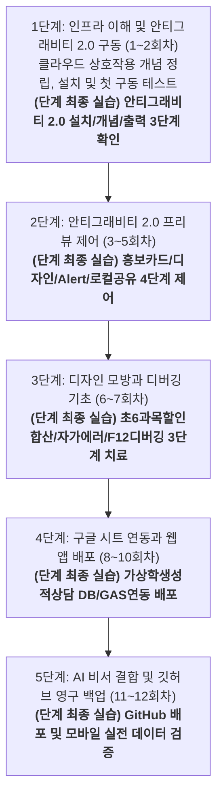

# [영상 교육 기획서] 학원 원장 대상 안티그래비티 2.0 활용 마스터 코스

본 교육 과정은 비대면 영상 강의(유튜브 및 온라인 튜토리얼)를 보고 수강생들이 스스로 학습하는 **'비대면 자기주도형 영상 교육'**에 특화되어 설계되었습니다. 

강사의 즉각적인 오프라인 조력이 없는 환경임을 고려하여, 수강생의 모든 조작 동선을 복잡한 로컬 PC 설정이 아닌 **'안티그래비티 2.0' 에디터 플랫폼 중심**으로 단일화했습니다. 덧셈(안티그래비티 프리뷰에 텍스트 출력)을 모르는 이에게 미적분(깃허브 연동, 서버 배포)을 요구하지 않도록, **"사전 시청한 영상 1개의 실제 내용과 안티그래비티 2.0 실습 수준이 100% 일치"**하도록 재설계하여 수강생들이 낙오 없이 완독할 수 있도록 구성했습니다.

> [!IMPORTANT]
> 본 기획서의 모든 동영상 가이드는 마우스로 클릭하면 즉시 유튜브의 실제 해당 영상으로 바로 연결되는 **"정식 하이퍼링크"**로 구성되어 있습니다. 수강생들은 링크를 클릭하여 즉시 강의를 시청할 수 있습니다.

---

## 📅 [대분류] 안티그래비티 2.0 중심 단계별 학습 로드맵

---

## 🛠️ [소분류] 단계별 세부 교육 과정 (12회차 통합본)

### 1단계: 인프라 이해 및 안티그래비티 2.0 구동 (1~2회차)
*   **단계 학습 목적**: 비대면 영상 강의 수강을 위해 인터넷 클라우드 서버와 내 안티그래비티 에디터의 통신 관계를 이해하고, 안티그래비티 2.0 설치 및 첫 구동 환경을 완벽하게 세팅하는 것입니다.
*   **종합 실습 프로세스**: 
    1.  **인프라 이해**: 만화 동영상을 시청하여 클라우드 서비스와 안티그래비티의 상호작용 개념 정립.
    2.  **프로그램 설치**: 안티그래비티 2.0 독립 실행형 도구를 다운로드하고 에이전트 가동 테스트 완료.

#### 1회차: 내 안티그래비티 2.0과 인터넷 클라우드의 작동 원리
*   **권장 시청 영상**: [서버란 무엇인가요? | 얄팍한 코딩사전](https://www.youtube.com/watch?v=R0YJ-r-qLNE)
*   **영상 실제 내용**: 원격 서버의 개념, 클라우드 호스팅의 개념, 그리고 내 컴퓨터와 클라우드가 데이터를 송수신하고 작동하는 기본적인 웹 인프라 구조를 만화와 비유로 설명합니다.
*   **주차 학습 내용**: 동영상을 시청하고 안티그래비티 에디터 외부 연동 시 필요한 기본 클라우드 통신 구조 이해하기.

#### 2회차: 안티그래비티 2.0 에디터 다운로드 및 첫 구동
*   **권장 시청 영상**: [바이브코딩 구글 안티그래비티로 웹사이트 만들기 7탄 (제미나이 사용법, 안티그래비티 설치방법)](https://www.youtube.com/watch?v=hUtwQcRBods)
*   **영상 실제 내용**: 코딩 지식 없이 구글 안티그래비티(Google Antigravity) 에디터를 다운로드하고 초기 권한 및 환경을 세팅하는 과정을 안내합니다.
*   **주차 학습 내용**: 영상을 참고하여 안티그래비티 에디터 설치법을 배우고 실행 환경 설정을 완료합니다.

#### 🎯 [1단계 최종 실습과제]: 안티그래비티 2.0 첫 구동 및 인프라 이해 2대 핵심 미션
*   *실습 미션*: 다음 2가지 핵심 미션을 순서대로 하나씩 자력으로 수행하십시오.
    *   **[미션 1 - 첫 구동 및 파일 확인]**: 개강 전 미리 다운로드해 둔 에디터 실행 파일을 더블클릭하여 첫 화면을 활성화해 봅니다. 그 후, AI 비서에게 첫 인사를 건네어 환영 답변이 정상 출력되는지 확인하고, 에디터 내에 구성된 주요 파일들(HTML, MD, GS, JS)의 역할에 대해 AI에게 직접 질문하여 가이드를 함께 확인해 보세요.
    *   **[미션 2 - 개념]**: 1회차 서버 개념 영상을 보며, 내 컴퓨터 에디터와 인터넷 클라우드 에이전트가 어떻게 데이터를 서로 주고받으며 동작하는지 그 원리를 가볍게 이해하고 넘어가 봅니다. 또한 미션1에서 문의한 내용을 깔끔한 HTML파일로 생성해 봅니다.

---

### 2단계: 안티그래비티 2.0 프리뷰 제어 (3~5회차)
*   **단계 학습 목적**: 깃허브나 서버 배포 같은 고난도 허들 없이, 오직 안티그래비티 에이전트와 대화하는 자연어 명령(프롬프트) 작성을 통해 내장 프리뷰 창에 웹 요소를 직접 띄우고 다듬는 실습입니다.
*   **종합 실습 프로세스**: 
    1.  **용어 습득**: AI 에이전트를 지휘하기 전 필수 IT 기초 어휘 20개 정리.
    2.  **자연어 명령**: 안티그래비티 에디트에 내 포트폴리오 프로필 명함 정보를 자연어로 전달.
    3.  **프리뷰 조율**: 한 번에 과도한 코딩 요구를 하지 않고 잘게 쪼개어 제어하는 프롬프트 조율 요령 학습.
    4.  **최종 실습 수행**: 내장 프리뷰 창에 한글 명함과 버튼을 100% 정상 출력 완료.

#### 3회차: 안티그래비티 에디트 조종용 필수 개념 용어 학습
*   **권장 시청 영상**: [개발 용어들, 헷갈리셨죠? 얄팍하게 정리해 드립니다 | 얄팍한 코딩사전](https://www.youtube.com/watch?v=GYmuQJiPeM4)
*   **영상 실제 내용**: 빌드, 디버그, API, 프레임워크 등 개발자와 대화하거나 에이전트 명령을 내릴 때 혼용하는 기본 IT 기초 어휘 개념을 쉽게 설명합니다.
*   **주차 학습 내용**: 학습 노트를 펴고 영상에 나오는 20대 용어를 메모하여 안티그래비티 에디트와 대화할 어휘 빌드업.

#### 4회차: 자연어 지시를 통한 프리뷰 화면 명함 출력 학습
*   **권장 시청 영상**: [바이브코딩 구글 안티그래비티로 웹사이트 만들기 1탄](https://www.youtube.com/watch?v=AWpy4w8Fd8k)
*   **영상 실제 내용**: 구글 안티그래비티를 실행한 상태에서 챗 창에 자연어로 요구사항을 내려 화면을 실시간 코딩하고 내장 프리뷰 창에 웹 화면을 표출하는 원리를 보여줍니다.
*   **주차 학습 내용**: 영상을 참고하여 에이전트에게 자연어 프롬프트 명령을 내리고 소통하는 기본 구조를 익힙니다.

#### 5회차: 프리뷰 레이아웃 정밀 튜닝 및 지시 쪼개기 기법 학습
*   **권장 시청 영상**: [바이브코딩 구글 안티그래비티로 웹사이트 만들기 5탄 (보안방법, UI디자인)](https://www.youtube.com/watch?v=Zdpb8Ljew_U)
*   **영상 실제 내용**: 기존 웹사이트나 이미지를 참고하여 안티그래비티 에디트에 UI 리디자인을 명령하는 방법, 그리고 스티치(Stitch) 도구와 연동하여 레이아웃을 단계적·정밀하게 다듬는 방법을 시연합니다.

#### 🎯 [2단계 최종 실습과제]: 홍보카드/디자인/Alert/로컬공유 4대 핵심 미션
*   *실습 미션*: 3~5회차 학습 내용을 바탕으로 다음 4가지 핵심 미션을 완수하십시오.
    *   **[미션 1 - 홍보 카드]**: 내 학원(또는 본인)을 홍보할 수 있는 카드형 UI 요소를 프리뷰에 자유롭게 배치하도록 명령해 봅니다.
    *   **[미션 2 - 디자인]**: 5회차 영상의 UI 리디자인 기법을 활용하여 배경 색상, 테두리 둥글기, 폰트 정렬 등 디자인 레이아웃 정밀 튜닝하시오.
    *   **[미션 3 - Alert]**: 홍보 카드 내에 '전화 문의' 버튼을 추가하고, 클릭 시 안내창(Alert Popup)이 깔끔하게 작동되도록 하십시오.
    *   **[미션 4 - 로컬공유]**: 완성된 파일들이 로컬 PC의 어느 경로에 저장되었는지 탐색하여, 이 파일 자체를 압축하여 타인에게 전달하고, HTML파일을 클릭했을 때 정상적으로 열리고 공유되는지 확인하십시오.

---

### 3단계: 디자인 모방과 디버깅 기초 (6~7회차)
*   **단계 학습 목적**: 에이전트에게 캡처 이미지를 제공해 레이아웃을 모방하는 방식을 학습하고, 웹앱 동작 설계 시 발생하는 실행 에러를 개발자 콘솔 로그 복사를 통한 에이전트 자율 QA 디버깅 기능으로 해결하는 법을 익힙니다.
*   **종합 실습 프로세스**:
    1.  **모방 기술 습득**: 이미지를 읽어 화면 레이아웃과 스타일을 복제해 내는 에이전트 동작 원리 이해.
    2.  **디버깅 기술 습득**: 프로그램 오작동 발생 시 콘솔 로그를 활용한 에이전트 에러 치료법 학습.
    3.  **최종 실습 수행**: 단과 계산기 웹앱을 만들고 에러 발생 지점을 자율 QA로 치료하여 완성.

#### 6회차: 스크린샷 캡처 업로드를 통한 안티그래비티 스타일 모방 학습
*   **권장 시청 영상**: [바이브코딩 구글 안티그래비티로 웹사이트 만들기 3탄 (UI디자인, 에이전트)](https://www.youtube.com/watch?v=eF9KA1XXi60)
*   **영상 실제 내용**: 완성된 웹 페이지의 캡처 스크린샷 이미지를 안티그래비티 에이전트에 제공하고, 이미지 내의 레이아웃 요소를 분석하여 에디트에상에 스타일 복제를 명령하는 시연을 다룹니다.
*   **주차 학습 내용**: 안티그래비티 3탄 UI 디자인 영상을 시청하고, 학원 홍보 전단지나 캡처 이미지를 에디트에 업로드하여 3단 랜딩 페이지로 스타일을 모방하고 복제하도록 명령하는 조종법을 익힙니다.

#### 7회차: 계산 기능 수식 적용 및 안티그래비티 QA봇 디버깅 학습
*   **권장 시청 영상**: [[코딩 1도 몰라도 만드는 나만의 PC 프로그램 1탄] 클립보드 붙여넣기 정리 프로그램 만들기](https://www.youtube.com/watch?v=gwej2gnigJY)
*   **영상 실제 내용**: 안티그래비티 에이전트로 PC 프로그램을 처음부터 직접 빌드하는 실전 과정을 보여줍니다. 제작 도중 오류가 발생하면 키보드 F12를 눌러 콘솔 로그를 복사한 뒤 에이전트에게 붙여넣어 자율 디버깅을 지시하는 에러 치료 기법을 실전으로 익힐 수 있습니다.

#### 🎯 [3단계 최종 실습과제]: 초6과목할인합산/자가에러/F12디버깅 3대 핵심 미션
*   *실습 미션*: 다음 3가지 핵심 미션을 완성하십시오.
    *   **[미션 1 - 과목할인합산]**: 단과 수강료 계산기 웹 앱을 만들고, 가상의 학생이 다양한 수강과목을 선택했을 때, 그 수강료의 합을 계산하고 15%의 결합 할인율을 적용하여 선택에 따른 최종 수강료가 웹 화면에 보여지도록 로직을 탑재하십시오.
    *   **[미션 2 - 자가 에러]**: 연산 입력창에 숫자가 아닌 문자를 고의로 입력하여 예외 연산 에러(NaN 등) 및 인위적인 오류가 발생하게 만드십시오.
    *   **[미션 3 - F12디버깅]**: 7회차 영상 가이드를 기반으로 키보드 F12 키를 눌러 개발자 도구의 Console 창을 열고, 빨간색 에러 로그를 복사해 안티그래비티 챗 창에 입력하여 에이전트가 스스로 버그를 고치는 자율 QA 과정을 완료하십시오.

---

### 4단계: 구글 시트 연동과 웹 앱 배포 (8~10회차)
*   **단계 학습 목적**: 구글 시트를 학원의 데이터베이스(DB)로 엮고, 안티그래비티가 빌드한 구글 앱스 스크립트(GAS) 코드를 이식하여 모바일 접속 주소를 발급받는 전 과정을 완수합니다.
*   **종합 실습 프로세스**:
    1.  **구글 DB 연동**: 구글 스프레드시트에 테이블을 파고 AI에게 연동 구조를 설명하는 법 습득.
    2.  **모바일 배포**: 생성된 GAS 코드를 새 배포하여 모바일 전용 고유 URL을 획득하는 흐름 실습.
    3.  **최종 실습 수행**: 웹 화면에서 버튼을 누르면 구글 시트에 행 데이터가 즉시 저장되는 1버튼 입력기 배포.

#### 8회차: 구글 스프레드시트 구조 이해 및 안티그래비티 연동 설계 학습
*   **권장 시청 영상**: [코딩 몰라도 AI로 앱 개발?! 구글 시트로 10분 만에 끝내는 방법 | 오빠두엑셀](https://www.youtube.com/watch?v=F01zL3r0a14)
*   **영상 실제 내용**: 구글 시트와 앱스 스크립트, 그리고 AI(Gemini)를 연동하여 별도의 코딩 지식 없이 데이터를 송수신하고 처리하는 웹앱 제작과 배포 과정을 시연합니다.
*   **주차 학습 내용**: 구글 시트에 학생 이름, 연락처 등의 데이터 열(Column)을 기획하고 연동 데이터 구조를 파악합니다.

#### 9회차: 안티그래비티 생성 GAS 이식 및 구글 웹앱 배포 학습
*   **권장 시청 영상**: [코딩 몰라도 AI로 앱 개발?! 구글 시트로 10분 만에 끝내는 방법 | 오빠두엑셀](https://www.youtube.com/watch?v=F01zL3r0a14)
*   **영상 실제 내용**: 구글 시트의 앱스 스크립트 에디터에서 웹앱 '새 배포' 설정을 마우스 클릭으로 간편하게 수행하여 누구나 접속 가능한 모바일용 웹 URL 주소를 런칭하는 흐름을 보여줍니다.
*   **주차 학습 내용**: 안티그래비티가 구글 시트 연동용으로 작성한 GAS 코드를 시트 스크립트 에디터에 이식하고 권한 승인을 완료하는 법을 익힙니다.

#### 10회차: API 통신 구조 학습 및 Gemini API 획득
*   **권장 시청 영상**: [API가 뭔가요? 가장 쉽게 이해시켜드림 | 얄팍한 코딩사전](https://www.youtube.com/watch?v=GjYJp3q4x-4)
*   **영상 실제 내용**: 프로그램들이 서로 통신하기 위한 다리 역할을 하는 API와 보안을 위한 API Key 개념을 식당 점원 비유를 통해 아주 쉽고 직관적으로 이해시켜줍니다.

#### 🎯 [4단계 최종 실습과제]: 가상학생성적상담 DB/GAS/Gemini AI 연동 4대 핵심 미션
*   *실습 미션*: 구글 스프레드시트와 앱스 스크립트 연동을 다음 4가지 핵심 미션을 진행하십시오.
    *   **[미션 1 - 성적 및 상담 DB]**: 구글 스프레드시트에 '학생명/학년/점수/상담일자/상담결과'를 입력할 수 있는 테이블 컬럼 구조를 생성하고, 이를 본인의 구글 드라이브 내부 학원 상담용 기본 데이터베이스(DB)로 기획하십시오.
    *   **[미션 2 - 화면 구축]**: 이 데이터베이스(DB)가 컴퓨터 화면에 출력되도록 디자인을 구축하시오.
    *   **[미션 3 - AI 비서 결합]**: 수업 중 가이드에 따라 Google AI Studio에 접속하여 무료 Gemini API Key를 즉석 발급받아 코드에 등록한 뒤, 학생 성적 데이터에 기반해 상황별 맞춤 안부 멘트를 자동 완성해 주는 AI 비서 기능을 연동해 봅니다.
    *   **[미션 4 - GAS 연동 배포]**: 안티그래비티가 자동 작성해 준 구글 앱스 스크립트(GAS) 코드를 스프레드시트 에디터에 이식하고, 구글 웹앱 '새 배포' 설정을 수행하여 모바일이나 디자인된 화면에서 입력 버튼을 누르면 구글 시트 데이터베이스에 실시간으로 데이터가 저장되는 프론트엔드-백엔드 연동을 완료하시오.

---

### 5단계: AI 비서 결합 및 깃허브 영구 백업 (11~12회차)
*   **단계 학습 목적**: 구글 Gemini API를 내 구글 웹앱에 이식하여 상황별 메시지 자동 완성 비서 서비스를 구현하고, 평생 소장할 마스터 코드를 안티그래비티 Git 제어판을 통해 깃허브 저장소에 백업하여 교육을 마감합니다.
*   **종합 실습 프로세스**:
    1.  **AI 탑재**: 구글 AI 스튜디오에서 발급받은 Gemini API 키를 내 웹앱 코드에 심는 법 습득.
    2.  **최종 릴리즈**: AI 자동 안부문자 완성 웹앱 서비스를 최종 업데이트 배포하여 스마트폰 탑재.
    3.  **영구 보존**: 안티그래비티 Git 제어판을 활용하여 원클릭으로 깃허브 원격 저장소에 업로드 마감.

#### 11회차: 안티그래비티 AI 비서 탑재 및 1초 안부문자기 최종 배포 학습
*   **권장 시청 영상**: [5분 만에 끝내는 Google AI Studio API 키 발급 및 사용법](https://www.youtube.com/watch?v=hyD7YdTqhM8)
*   **영상 실제 내용**: 발급받은 외부 Gemini AI API 키를 웹앱의 입력 폼에 탑재하여, 프롬프트 지시에 따라 상황별 어투(존댓말)에 맞춰 실시간 텍스트 안부 문장을 생성하고 문자/카카오톡 전송 창을 띄워주는 연동 방식을 다룹니다.
*   **주차 학습 내용**: 영상을 통해 구글 AI 스튜디오 가입 및 무료 API Key를 발급받은 뒤, 안티그래비티 코드 내에 생성된 API 변수 자리에 발급받은 키를 맵핑하고 문자 자동 완성을 연동시키는 흐름을 파악합니다.

#### 12회차: 안티그래비티 2.0 원클릭 Git 연동 및 최종 백업 마스터
*   **권장 시청 영상**: [제대로 파는 Git & GitHub (리뉴얼) | 얄팍한 코딩사전](https://www.youtube.com/watch?v=0TEPC1UDGM0)
*   **영상 실제 내용**: 코드 버전 관리와 백업의 필수 도구인 Git의 기본 사용법과 GitHub 원격 저장소에 프로젝트를 연동하여 평생 백업하는 과정을 총정리해줍니다.

#### 🎯 [5단계 최종 실습과제]: GitHub 배포 및 모바일 실전 데이터 검증 2대 핵심 미션
*   *실습 미션*: 커리큘럼의 최종 릴리즈 및 백업을 위해 다음 2가지 핵심 미션을 연속으로 수행하십시오.
    *   **[미션 1 - GitHub 배포]**: 수업 중 영상 안내를 보며 GitHub 무료 계정에 새로 가입한 뒤 안티그래비티 2.0의 Git 메뉴를 활용해 내 GitHub 계정과 연동해 봅니다. 4단계에서 빌드한 성적 및 상담 입력 웹앱 소스코드를 깃허브 원격 저장소에 원클릭으로 커밋/푸시하여 인터넷상에서 누구나 들어올 수 있는 고유 웹 주소(URL)를 생성해 보세요.
    *   **[미션 2 - 모바일 실전 데이터 검증]**: 5단계에서 GitHub 배포를 통해 발급받은 본인의 깃허브 웹사이트 URL 주소로 스마트폰을 통해 직접 접속한 후, 추가로 다른 가상의 학생 성적 및 상담 결과를 전송하여 구글 스프레드시트 DB에 해당 데이터 행이 누락 없이 실시간으로 즉시 기록 및 축적되는지(백엔드와 프론트엔드가 정상 작동하는지) 최종 데이터 파이프라인의 무결성을 전수 교차 검증하십시오.

---

## 🚨 [보너스 가이드] 사전 준비물 및 에러 대처 가이드

### 1. 개강 전 필수 준비물 리스트
*   **구글(Google) 계정**: 구글 드라이브 및 스프레드시트(성적/상담 DB) 연동을 위해 미리 계정을 준비해 둡니다.
*   **안티그래비티 에디터**: 1주차 첫 구동 실습을 위해 무설치 실행 파일을 미리 컴퓨터에 다운로드해 둡니다.

### 2. 안티그래비티 2.0 실습 중 오작동/에러 발생 시 대처법
*   **권장 시청 영상 (디버깅 가이드)**: [[코딩 1도 몰라도 만드는 나만의 PC 프로그램 1탄] 클립보드 붙여넣기 정리 프로그램 만들기](https://www.youtube.com/watch?v=gwej2gnigJY) 영상을 통해 F12 콘솔 디버깅 시연 시청
*   **상황별 조치 매뉴얼**:
    *   **[1순위 조치] AI 비서에게 대화로 질문**: 에러가 나거나 화면이 깨질 때는 당황하지 말고 안티그래비티 챗 창(또는 Gemini)에 현재 겪는 오작동 증상을 대화하듯 질문해 보세요. AI 비서가 원인을 진단하고 명확한 대처법을 가이드해 줍니다.
    *   **[2순위 조치] 동작 에러 대응 (F12 콘솔 복사)**: 기능에 에러가 뜰 때는 키보드 **F12**를 눌러 개발자 도구를 켜고, `Console` 탭의 빨간색 영어 에러 로그를 긁어 안티그래비티 챗 창에 붙여넣은 뒤 해결을 요청합니다.
    *   **[3순위 조치] 화면 멈춤 대응 (Stop & 롤백)**: 빌드가 루프에 빠진 것처럼 화면에 무한 로딩이 걸린 경우, 우측 상단의 `Stop`을 누르고 챗 창에 "방금 짠 코드 지우고 이전 정상 버전으로 롤백해줘"라고 지시해 봅니다.
